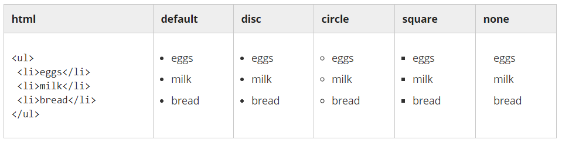
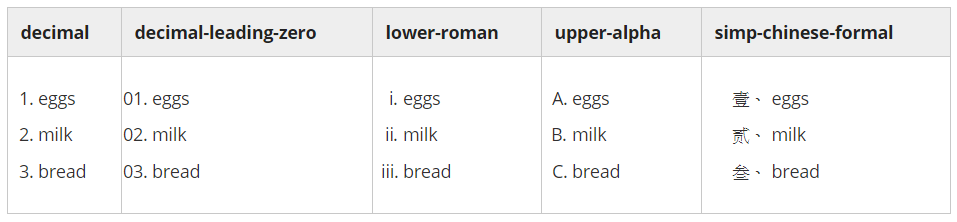
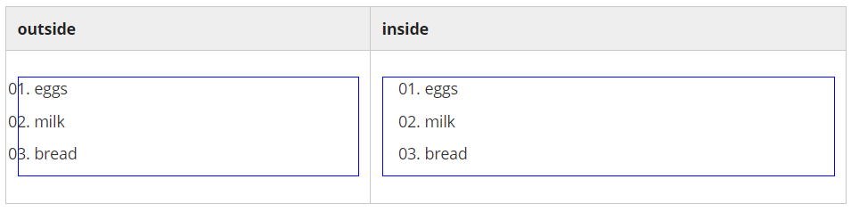
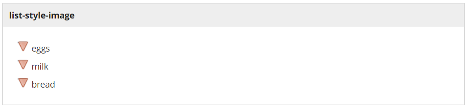
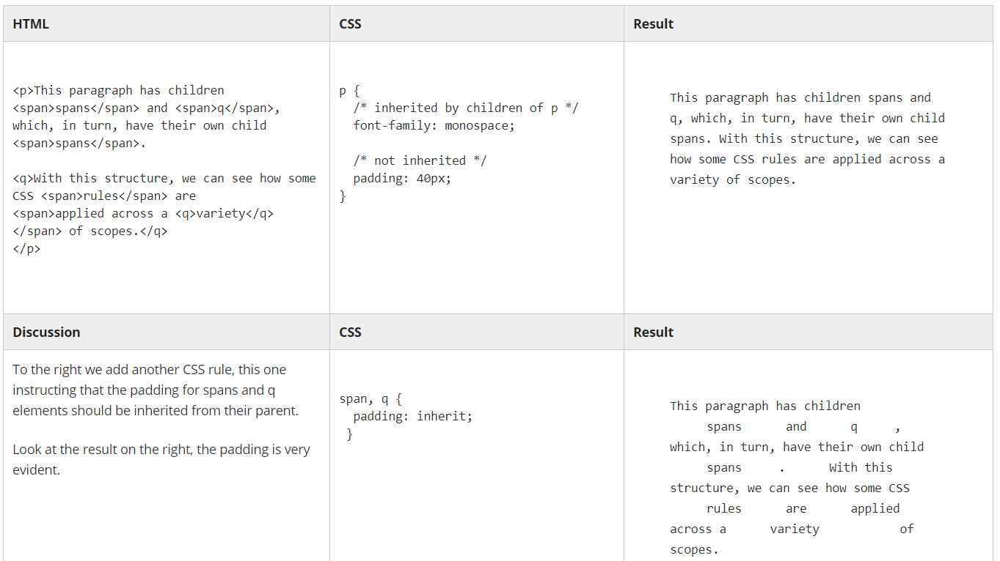

# Module 3: Adding style with CSS

## 3.1 Introduction to Module 3


### Welcome to Module 3

<a href="https://edx-video.net/W3CHTM502016-V010200_DTH.mp4" alt="Introduction to Module 3" target="_blank">
    
</a>

### Module 3 - Content

+ 3.1 __Introduction to Module 3__: Get an overview of what CSS (Cascading Style Sheets) can do for your Web pages.
+ 3.2 __CSS basic syntax__: Understanding the language of CSS: style tags, links tags, rules, and comments.
+ 3.3 __CSS properties__: Here, you will be introduced to just a few of the many properties that make CSS such a powerful tool.
+ 3.4 __Lists and selectors__: List markup tags (`<ul>`, `<ol>` and `<li>`) are some of the most frequently used specific purpose tags in HTML, and selectors are what allows you to target specific HTML elements and apply style to them
+ 3.5 __Exercises - Module 3__: Let's see what you learned in Module 3 of the course.

### The CSS language

<n style="color:cyan">__CSS__ logoCSS stands for 'Cascading Style Sheets'. For now, do not worry about what the 'Cascading' part means and just focus on the 'Style Sheets'.</n>

Using CSS, we can determine the visual appearance of our HTML elements independent of the HTML itself.

Recall the metaphor we used for HTML with the journalist and the publisher. Where HTML represents the author's work, CSS corresponds to the work the designer does: deciding how things look.

In the early days, there was no CSS, so any control over what the page looked like was done with tags that controlled the form of the Web page. Tags like `<font>` to choose a font, `<b>` for bold, `<i>` for italic were added to have some control, and that let your page be at the mercy of whatever browser the reader was using. There are several problems with this approach. _First_, it violates our paradigm of HTML containing only content. _Second_, and more practically, the tags only applied where they were used.

For instance, if you originally wrote your document with all the paragraphs indented with a certain amount and then later you were decided to change the indentation, then you would have to modify every single paragraph in your document. It would be nice if there were a central way to set such rules, i.e. one place that said "I want all my paragraphs to be indented this much", much like master sheets in a word processor. CSS helps to solve this problem.


### The W3C CSS Working Group

The __CSS Working Group__ (Cascading Style Sheets Working Group) is a [working group](https://en.wikipedia.org/wiki/Working_group) created by the W3C in 1997 to tackle issues that had not been addressed with CSS level 1. The [number of members](https://www.w3.org/Style/CSS/members) reaches 126 in December 2017!

<a href="https://courses.edx.org/courses/course-v1:W3Cx+HTML5.0x+2T2018/courseware/93b25250542a4c7898d9184a93558f59/d01e4fccca73417fae77b8612cb8c9b5/?child=first"> <br/>
    
</a>

The CSS WG members are working on a [whole range of specifications](https://www.w3.org/Style/CSS/current-work), but their core document is [CSS snapshot 2017](https://www.w3.org/TR/css-2017/). This document collects together into one definition all the specs that together form the current state of Cascading Style Sheets (CSS) as of 2017. The primary audience is CSS implementers, not CSS authors, as this definition includes modules by specification stability, not Web browser adoption rate.

### An example

Let's see CSS in action. Below, we see two identical copies of HTML, however, styled differently.

Here is the HTML:

```html
<p>She looked over the top of her book and whispered <q>I'm hungry.</q> My heart stopped.</p>
```

And now two very different looks:

<p>She looked over the top of her book and whispered <q>I'm hungry.</q> My heart stopped.</p>

She looked over the top of her book and whispered<br/>
i'm hungry.<br/>
My heart stopped.

Both of these use the exact same HTML. It is the CSS that makes them so different. So let's get started.


## 3.2 CSS basic syntax

### Style and link tags

#### The 'style' tag

The best practice when working with CSS is to keep it in an external file using the `<link>` tag, however, when starting, it is simpler to merely place it directly into the document under edit.  

To place CSS directly into an HTML document, we use the `<style>` tag.  This tag can appear anywhere in an HTML document, however, the most common practice is to place it in the `<head>` section.  Such as:

```html
<!DOCTYPE html>
<html lang="en">
 
  <head>
    <meta charset="UTF-8">
    <title>Style and link tags</title>
    <style>
      /* CSS will go in this area */
    </style>
  </head>
 
  <body>
  </body>
</html>
```

#### The 'link' tag

While `<style>` is convenient, the better practice is to put the CSS into a separate file. One of the key advantages of using a separate file is that the CSS styles can easily be re-used between your different `.html` pages.  Many authors further divide their CSS up into different files (for example: one for text styles and another one for layout).  

Simply put your CSS into a separate file. This file does not need any HTML markup (i.e., no `<style>` tag required).  Use the `.css` file extension and use a `<link>` tag to bind it in. The `<link>` tag must appear in the `<head>` section.  By convention, css files are kept in a directory named `css`.

Use this `<link>` as a template:

```html
<link rel="stylesheet" href="css/my_styles.css">
```

Here is an example HTML document.

```html
<!DOCTYPE html>
<html lang="en">
 
  <head>
    <meta charset="UTF-8">
    <title>Style and link tags</title>
    <link rel="stylesheet" href="css/my_styles.css">
  </head>
  <body>
  </body>
</html>
```

### Rules: selectors and declarations

At its simplest, CSS is just a list of rules.  Each rule consists of a selector and a declaration.  Here is an example:

<a href="https://courses.edx.org/courses/course-v1:W3Cx+HTML5.0x+2T2018/courseware/93b25250542a4c7898d9184a93558f59/5ca9519c008c4fe7b6ada01210cae4bf/2?activate_block_id=block-v1%3AW3Cx%2BHTML5.0x%2B2T2018%2Btype%40vertical%2Bblock%406c30de15475840a797ee65f74d409a00">
    
</a>

### Selector

In the above, the _selector_ is __`p`__.  When a selector appears unprefixed by any punctuation, then it is assumed to match to an HTML tag.  Thus, the __`p`__ selector will apply the CSS rule to all `<p>` tags in the document. 

We will cover more selector possibilities in the future.

#### Declaration

The _declaration_ part of a CSS rule opens and closes with curly braces: `{  }` <br/>
And between them, you can put any number of property value pairs.

#### Properties and Values

There are hundreds of different visual properties that may be set via CSS.  And each property has a range of possible values that it can be set to.  Syntactically, property value pairs are simple. Each pair consists of a _property_, followed by a colon `:` followed by a _value_ and terminated by a semi-colon `;`

```css
font-size: 12px;
```

#### Best practice

In the example above, the entire CSS rule is written on one line.  This is not uncommon when the declaration of the CSS rule only has one property.  If a CSS rule has several properties, then it should be written to use one line per property value pair. For example:

```css
p {
  font-size: 12px;
  line-height: 15px;
  color: #223344;
}
```

### Comments

CSS can include "comments" as well, by which you, the developer today, can leave notes and reminders to you, a different developer tomorrow. Or to others who might read your CSS.  

Comments begin with `/*` and must end with `*/` and they can span several lines. But they cannot be nested.

```css
p {
   font-size: 8px; /* client insists small text makes them more 'professional'. */
   /* I hope his idea of 'professional' includes paying on time. */
   line-height: 24px; /* see above */

   /* none of the stuff below is working. I don't know why.
   margin-top: 5%;
   margin-bottom:6%;
   */
}
```

### Knowledge checks (not graded)

Here are some questions for a self check to make sure you understand everything. These questions are not graded.

1. Tag support

    Which tag supports CSS code between its opening and closing tag?

    a. `<div> ... </div>` <br/>
    b. `<css> ... </css>` <br/>
    c. `<style> ... </style>` <br/>
    d. `<link> ... </link>`

    Ans: c <br/>
    Explanation: The `<style>` tag is used to place CSS code directly into an HTML document. While not considered a best practice it is convenient, especially for testing or exploration.

2. Link use

    Which of the following uses of the <link> tag is correct?

    a. `<link rel="stylesheet" href="css/my_styles.css" >` <br/>
    b. `<link rel="stylesheet" src="css/my_styles.css" >` <br/>
    c. `<link rel="css" >` <br/>
    d. `<link href="css/my_styles.css" >`

    Ans: a <br/>
    Explanation: The `<link>` tag needs two attributes specified, `rel` which must be "stylesheet" and `href` which names the CSS file.

3. Leveraging CSS

    What is the general best practice for leveraging CSS from a Web page?

    a. Bind in CSS from an external file with a `<link>` tag <br/>
    b. Enter CSS directly into a `<style>` block

    Ans: a <br/>
    Explanation: Keeping CSS in an external file is generally considered the best practice. CSS in an external file can be used by several different Web pages.


4. External CSS file

    Does the CSS in an external CSS file, like `my_file.css`, need to be surrounded by `<style> ... </style>` tags?

    Ans: No <br/>
    Explanation: An external `.css` file is not an HTML document and needs no tagged markup. The CSS can be included directly. Though, a good practice is to leave a comment at the top of the CSS file.

    ```css
    /* 
    my_styles.css 
    Jan 1, 2016 -- defining basic styles for website. 
    Jan 9, 2016 -- client wants color scheme changed to match favorite sports team (Go Barca!). 
    */
    ```


### Activity - Use CSS

Use CSS on the following HTML code. Try various styles, experiment, and have fun. We have a live coding demonstration below working with the same source.

You are welcome to edit the following [CodePen](https://codepen.io/w3devcampus/pen/QvQgbr) ... or work from the lines of code below (to paste in your favorite Web editor):

```html
<!DOCTYPE html>
<html lang="en">
<head>
    <meta charset="UTF-8">
    <title>On the Inventor of Gunpowder</title>

    <style>
        /* CSS */
    </style>

</head>

<body>

    <h1>On the Inventor of Gunpowder.</h1>

    <address rel="author">By John Milton</address>

    <p>Praise in old time the sage Prometheus won,<br>
    Who stole ethereal radiance from the sun;<br>
    But greater he, whose bold invention strove<br>
    To emulate the fiery bolts of Jove.</p>

</body>
</html>
```

You could also take another short text (such as a poem) and apply the styles you like on it.


### Live coding video: CSS rules

<a href="https://edx-video.net/W3CHTM502016-V013900_DTH.mp4" alt="<style tag> example" target="_blank">
     
</a>


## 3.3 CSS properties

### Common CSS properties

There are hundreds of CSS properties for you to use. The [complete list](https://www.w3.org/Style/CSS/all-properties.en.html) is available on the W3C Web site (or also, see the [CSS reference page on the MDN Web site](https://developer.mozilla.org/en-US/docs/Web/CSS/Reference)).

Below we've gathered a more manageable list of the most useful and common CSS properties: `font-size`, `line-height`, `text-align`, `text-decoration`, `font-weight`, `font-style` and `font-family`.

#### font-size

`font-size` can be used to size the text of a tag.  The value for the `font-size` has two parts: a number and a unit.  Some of the most common units are: `px`, `em`, `%`, `vh`.  For example:

```css
p { font-size: 18px; }
q { font-size: .8em; }
blockquote { font-size: 10vh; }
```

These units are discussed below.

Additionally, `font-size` supports a more readable set of values that many authors prefer: `xx-small`, `x-small`, `small`, `medium`, `large`, `x-large`, `xx-large`  
and relative sizing (relative to the text of the parent): `larger`, `smaller`. For example:
```css
p { font-size: medium; }
q { font-size: small; }
blockquote { font-size: larger; }
```


#### line-height

Whereas `font-size` may drive the size of the text itself, the `line-height` property drives the height of the space it is drawn into.  A large `line-height` will give the text more spacing. A small `line-height` will smash the text lines together.  

For example, all of the Middlemarch text below has `font-size:16px;`  
But on the left, we see `line-height:0.5;` and on the right, `line-height:3;` 

| `line-height: 0.5;` | `line-height: 3;` |
|---------------------|-------------------|
| <n style="line-height: 0.5;"> Miss Brooke had that kind of beauty which seems to be thrown into relief by poor dress.</n> | <n style="line-height: 3;"> Miss Brooke had that kind of beauty which seems to be thrown into relief by poor dress. </n> |

The used value is this unitless `<number>` multiplied by the element's font size. The computed value is the same as the specified `<number>`. In most cases __this is the preferred way__ to set `line-height` with no unexpected results in case of inheritance. Read more on the MDN Web site.


#### text-align

Anyone familiar with a text editor will be familiar with this property. It can be used to align the text `left`, `center` or `right`.  There are additional possible values like `justify` and `justify-all`. It usually defaults to `left`. However, remember that you shouldn't use `text-align` unnecessarily.

Note that `text-align` may __not__ work as expected if applied to elements that are the same width as their text, or whose width is determined by the text within them (i.e., inline elements).  The tags `<span>`, `<a>`, `<i>`, `<b>`, `<q>` and others are considered "inline" because they do not receive their own new line when used. And `text-align` is often not useful on these tags.

But it is useful on block level text tags, such as `<p>`, `<li>`, `<ul>`, `<ol>`, `<div>`, and `<blockquote>`

```css
p { text-align: left; }
blockquote { text-align: right; }
```

Bear in mind, also, that you should only use `text-align` when the alignment really needs to be changed, since it can cause additional work to reverse all the values when translating into languages that use _Arabic_, _Hebrew_, _Thaana scripts_, _scripts_ (the default alignment for those languages is `right`).  The new values __start__ and __end__ are currently being implemented in browsers, and those will be a much better choice than _left_ and _right_ once Internet Explorer supports them.

| left | center |
|:------|:--------:|
| It was the best of times, it was the worst of times, it was the age of wisdom, it was the age of foolishness, it was the epoch of belief, it was the epoch of incredulity, it was the season of Light, it was the season of Darkness, it was the spring of hope, it was the winter of despair. | It was the best of times, it was the worst of times, it was the age of wisdom, it was the age of foolishness, it was the epoch of belief, it was the epoch of incredulity, it was the season of Light, it was the season of Darkness, it was the spring of hope, it was the winter of despair. |

| right | justify |
|-------:|:---------:|
| It was the best of times, it was the worst of times, it was the age of wisdom, it was the age of foolishness, it was the epoch of belief, it was the epoch of incredulity, it was the season of Light, it was the season of Darkness, it was the spring of hope, it was the winter of despair.| <span style="text-align:justify;"> It was the best of times, it was the worst of times, it was the age of wisdom, it was the age of foolishness, it was the epoch of belief, it was the epoch of incredulity, it was the season of Light, it was the season of Darkness, it was the spring of hope, it was the winter of despair. </span>|

Note that CSS will in the future provide better support for justification in languages where words are not separated by spaces, such as Chinese and Thai, or languages where words are separated by special marks, such as in Amharic. For more information about different approaches to justification see [this article](https://www.w3.org/International/articles/typography/justification). Once you finish this course, look out for these and other international features of CSS as you explore its features further.


#### Text-decoration (underline)

How do I underline text? This is a common question. In CSS, this is done via the text-decoration property.  The values for this are: `underline`, `overline`, `line-through`, and `none`;  They can combined.
```css
p { text-decoration: underline; }
a { text-decoration: none; } /* hyperlinks are underlined by default, but that can be removed */
span { text-decoration: overline; }
span { text-decoration: underline overline; } /* apply two with just a space between the values */
span { text-decoration: underline overline line-through; } /* everything */
```

| underline | overline | line-through | underline overline line-through |
|-----------|----------|--------------|---------------------------------|
| <span style="text-decoration:underline"> Middlemarch </span>|  <span style="text-decoration:overline">Middlemarch  </span>|  <span style="text-decoration:line-through">Middlemarch  </span>|  <span style="text-decoration:underline overline line-through;">Middlemarch  </span>|

Note: there are other properties that can help customize the text decoration, such as `text-decoration-color` and `text-decoration-style`, but as of this writing they are not well supported (Firefox only).


#### font-weight (bold)

Earlier we saw that the `<b>` and `<strong>` tags would make text bold-faced. However, semantically speaking, that is a mere side-effect of the tag. Any tag can make the text bolder (or less bold) via the `font-weight` CSS property.  While common values are `normal` and `bold`, text can also be made bolder (or less bold) than its parent with the values `bolder` and `lighter`. Lastly, the `font-weight` can be set explicitly as a numeric value. The choices are: `100`, `200`, `300`, `400`, `500`, `600`, `700`, `800` and `900`.  
`normal` maps to `400` and `bold` to `700`. However, the different numeric choices will only work for fonts that support a full range of font-weights. Many times the numeric weights will simply be mapped back to bold or normal.

```css
p { font-weight: bold; }
blockquote { font-weight: 900; }
```

| normal | bold | 200 | 500 | 700 | 900 |
|--------|------|-----|-----|-----|-----|
| <span style="font-weight:normal"> A Tale of Two Cities </span> | <span style="font-weight:bold">A Tale of Two Cities </span> | <span style="font-weight:200">A Tale of Two Cities </span> | <span style="font-weight:500">A Tale of Two Cities </span> | <span style="font-weight:700">A Tale of Two Cities </span> | <span style="font-weight:900">A Tale of Two Cities </span> |


#### FONT-STYLE (italic)

Earlier we saw that the `<i>` and `<em>` tags could make text italicized. But, just as we saw when discussing font-weight, this can be changed with CSS, and any tag can make its text italic or oblique with the font-style property.  The choices of values for this property are normal and italic.  

| font-style: normal; | font-style: italic; |
|---------------------|---------------------|
| Many years later, as he faced the firing squad, Colonel Aureliano Buendía was to remember that distant afternoon when his father took him to discover ice. | _Many years later, as he faced the firing squad, Colonel Aureliano Buendía was to remember that distant afternoon when his father took him to discover ice._ |


#### font-family

Want to set the font for an item on the page?   The `font-family` is the correct property for the task, but there are caveats:

+ the various browsers only guarantee a few standard choices: `serif`, `sans-serif`, `monospace`, `cursive`, and `fantasy`.
+ any other choice must be already installed on the users machine.
+ or you may use a "Web font", but your choices, while plentiful, may not match the choices you are used to.  
+ your favorite font on your machine is probably encumbered by licensing limitations and is not available. You can certainly specify it to be used, but if the end user doesn't have it themselves, they won't see it. And you can't "give" it to them. Again, "Web fonts" are the alternative here.

To help ameliorate these limitations, the `font-family` property accepts a `list` of possible font choices.  The browser will start with trying the first font listed, and if not available (or not having a needed glyph) it will then proceed to the next font in the list, and so on.  Here is a typical `font-family` declaration:

```css
p { font-family: "Helvetica", "Verdana", "Arial", sans-serif; }
```

The rule above says to first try the font named "Helvetica". If it isn't available, try "Verdana", failing that "Arial", and lastly fall back to the built in `sans-serif` browser font.

+ each of the named font families is separated by a comma ( `,` )
+ if the font family name contains any spaces (or certain other characters) it __must__ be surrounded by quotes. Font names tend to be complex, and the exact rules for when quotes are required are arcane, so the simplest and best practice is to __always surround the font family name in quotes__, excepting the five built-ins (`serif`, `sans-serif`, etc.)

Web fonts are outside the scope of this course. Google provides a nice selection of licensed free Web fonts. Type "google Web font tutorial" into any search engine to learn more.  


### Units: px, em, rem, %, vh, vw

`font-size`, `line-height`, `margins` and many other CSS properties expect some sort of dimension value. Dimension values support a wide variety of units. But the most common and useful ones are: `px`, `em`, `rem`, `%`, `vh` and `vw`.

#### px

'px' is short for 'pixel', which is a single dot on the screen.   So text with `font-size:20px` is 20 pixels tall on-screen. In actuality, due to browser zooming, retina displays, or other factors, this may or may not match to 20 physical on-screen pixels.

`px` are useful for both horizontal and vertical dimensions.

#### em

'em' is a typographic term that has come to the Web. On the Web, `em` units are usually used for _vertical dimensions_.  One 'em' maps to the height of one capital letter in the _parent context_.
```css
li { font-size: 0.9em; }  /* text in a list item is smaller than its parents */
h1 { font-size: 1.2em; }  /* but an h1 will be bigger than the parent */
i  { font-size: 0.5em; }  /* and any italicized text will be half as big. */
```

All the text sizes above are relative to the pages base sizes.  You'll see radically different results on the rest of the page from either of these rules applied to the body, but relative to one another they'll remain sized correctly.
```css
html, body { font-size: 50px; } /* 50 px base text size */
html, body { font-size: 20px; } /* 20 px base text size */
```

#### rem

'rem' is much like 'em', except that 'em' sizes an element relative to its __parent__, and 'rem' always derives its size relative to the __root__.  In an HTML document with lots of nested elements, 'rem' will generally prove to be more reliable than 'em'.  'rem' is supported in all modern day browsers, including mobile, but not older ones.

Using the CSS rules from the `em` section immediately above, nested list items (`<li>birds<ul><li>hawk</li></ul></li>`) would get increasingly smaller. And if 'rem' units were used, they would be the same size.

Note: to ensure you are setting the root size, use both the html and body selectors.

```css
html, body { font-size: 20px; } 
```

#### %

Whereas `em` is a measure relative to the parents text size, the percentage unit (`%`) is relative to the _parent dimension_.  This is a useful unit for both horizontal and vertical dimensions, though often more useful in the horizontal.  

```css
p { 
  margin-left:  10%;
  margin-right: 10%;  /* 10% of parent width will be spent on the two side margins */
}
```

Initially, the percentage unit may seem very handy (and it is), and many developers fall in love with it. But the love affair is usually short lived. One of the limitations of this rule is that for it to work correctly, the parent must have an explicit width or height set. This limitation is particularly noticeable in the vertical dimension. If the parent element doesn't have an explicit height set then child percentages may be percentages of 0.

#### vh / vw

'vh' stands for _viewport height_, and 'vw' for _viewport width_.  The 'vh' and 'vw' units work much like the percentage (%) unit. But instead of percentage of the parent, it is percentage of the screen (aka viewport).  Obviously, vh is for vertical dimensions, and vw for horizontal dimensions.

'vh' and 'vw' do not suffer the parent limitation that the % unit does.  Most modern browsers support these units, but there are some exceptions on older mobile browsers.

```css
p {
  margin-left:  10vw;
  margin-right: 10vw;  /* 10% of screen width will be spent on the two side margins */
 }
```

#### External Resources

The list of CSS units above is not exhaustive. There are various tutorials and explanations about CSS units on the internet. Here are a few that you might find helpful.

+ This CSS Tricks article from March 2016: "[Use _rem_ for Global Sizing; Use _em_ for Local Sizing](https://css-tricks.com/rem-global-em-local/)"
+ [New CSS3 Units: Root EM and Viewport Units](http://www.cssmine.com/css3-units)
+ From the W3C specification: [Viewport-percentage lengths](https://www.w3.org/TR/css3-values/#viewport-relative-lengths)


### Accessible typography

With great power comes great responsibility

The CSS rules with which we've started are fun and easily understandable. They are mostly concerned with typography. Later, we will see how to use CSS to include decorative images, look at other decorative properties, and take up the topic of layout.

But even with our modest start we must, once again, take up the topic of accessibility.  In Module 2, we learned that using the correct tag with the best semantic meaning is very important for a variety of reasons, one of which included visitors who may have a disability. If you clearly put your page navigation in a `<nav>` block, and use the header tags and others (like `<article>` or `<main>`), then this can greatly enhance the page experience for certain disabled visitors, like the blind who might be having the page read aloud to them with a screen reader.

Accessibility concerns are important for CSS usage as well. Perhaps doubly so. As page authors, if we don't use CSS, then the page visitor just sees the page with the default typography, and perhaps assisted by tools that can help zoom in on pages, make text bigger, invert colors for the light-sensitive, etc. But as we start to customize the look of the page with CSS, we may unintentionally thwart those tools or make the reading experience less comfortable for those with vision problems.

#### Guidelines

For accessible typography, there are really just a few things to avoid:

1. do not make text too small
2. do not make lines of text too tight
3. do not use foreground and background colors that are too close to one another, in other words, ensure there is good color contrast
4. do not irregularly space text or make it jump around

Look at those four guidelines. Can you match each guideline to one or more CSS property from earlier? Take a moment and think about it. We'll touch on specific rules below.

#### Properties

+ Font-size

    Misuse of `font-size` might make text too small. So be wary of that. Furthermore, in the past the gold standard practice was to use __`em`__ units instead of px. This is no longer as true as it was, but the practice of using em or rem units is definitely to be encouraged and it should be your default unit when working with text.

+ Line-height

    An overly small `line-height` will cause lines to become cramped and difficult to read. Even the largest text can be rendered unreadable by a too small `line-height`. Generally, your `line-height` should always be _at least one and a half times the font-size_ (ie, `line-height` should be greater than `1.5em`).

+ Color

    Color contrast can be easily undone by misuse of the `color` property.  The exact rules for contrast are rather advanced. For example, "wide stroke" text is allowed to have less contrast than narrow stroke text.  But, regardless of rules, the overall concept is easy to understand: keep your text high contrast to the background. There are further color guidelines concerning certain combinations (like bright blue text on a bright red background), but the rule of thumb is that, if the text is at all hard for you to read, then just assume it is unreadable to someone with a visual disability. If you are interested, there are tools that can help such as [Tanaguru Contrast-Finder](http://contrast-finder.tanaguru.com/) or [Juicy Studio Luminosity Colour Contrast Ratio Analyser](http://juicystudio.com/services/luminositycontrastratio.php).


+ Text-align

    Any long passage of text should have its alignment match its reading order. Which means, if the language is English, which is read left to right, then any long passage of text should be aligned left.  Right aligned or center aligned text can be very hard for dyslexics.

Obviously, a header or perhaps a menu might be exempt, because they are not typically long passages of text. So this guideline doesn't mean an end to good page layout and typography.

#### Summary

So now, we've seen how typography can affect the accessibility and approachability of your page. It is not so very difficult. Common sense and awareness are good companions and will serve you well.

If you are interested in accessibility, there is much more to learn. These simple guidelines merely scratch the surface.


### Knowledge checks (not graded)

Here are some questions for a self check to make sure you understand everything. These questions are not graded.

1. Size me!

    Which CSS property lets you adjust the size of the text?

    Ans: font-size <br/>
    font-size is the CSS property that governs the text size.

2. Space control

    Which CSS property allows you to control the spacing between html items?

    Ans: `margin` or `margin:` or `margin-top` or `margin-top:` or `margin-left` or `margin-left:` or `margin-right` or `margin-right:` or `margin-bottom` or `margin-bottom:` <br/>
    The `margin` property governs basic spacing between items.


3. Font-size values

    Which of the following is NOT an acceptable value for the font-size property?

    a. `medium` <br/>
    b. `x-small` <br/>
    c. `.4page` <br/>
    d. `1.2em` <br/>
    e. `.9rem` <br/>
    f. `larger` <br/>
    g. `14px` <br/>

    Ans: c


### Activity - Units

With the HTML below, please size the text using different units:

+ Use `px` units to set the root size of the text for the document.
+ Use `rem` units to size the `h1` and `li` tags.
+ Change the text size of the root CSS rule. You should observe all the text of the document adjusting appropriately.
+ Change the `h1` so that it uses `px` units. As the root CSS rule is changed, the `h1` will no longer adjust with the rest of the document.

Please experiment by editing the following [Codepen](https://codepen.io/w3devcampus/pen/YVeQZN):

```html
<!DOCTYPE html>
<html lang="en">

<head>
    <meta charset="UTF-8">
    <title>List</title>
    <style>
        /* CSS */
    </style>
</head>

<body>

    <h1>Books</h1> 
    <ol> 
        <li>A la Recherche de Temps Perdu</li>
        <li>Middlemarch</li>
        <li>Ulysses</li>
        <li>Don Quixote</li>
        <li>Moby Dick</li>
        <li>Hamlet</li>
        <li>War and Peace</li>
        <li>The Odyssey</li>
        <li>The Great Gatsby</li>
        <li>The Divine Comedy</li>
        <li>Madame Bovary</li>
        <li>The Brothers Karamazov</li>
        <li>One Hundred Years of Solitude</li>
        <li>The Iliad</li>
        <li>Lolita</li>
        <li>Anna Karenina</li>
        <li>Crime and Punishment</li>
        <li>The Sound and the Fury</li>
        <li>Wuthering Heights</li>
        <li>Le Rouge et le Noir</li>
    </ol>

</body>
</html>
```


## 3.4 Lists and selectors

### Styling lists

The list markup tags (`<ul>`, `<ol>` and `<li>`) are some of the most frequently used specific purpose tags in HTML. There are a few CSS style properties that are available for lists.

#### list-style-type

`list-style-type` governs the little list marker that is usually positioned to the left of any list item.  For un-ordered lists (`<ul>`), there are several popular values: `disc`, `circle`, `square`, and `none`.

```css
li { list-style-type: disc; }
```

<a href="https://courses.edx.org/courses/course-v1:W3Cx+HTML5.0x+2T2018/courseware/93b25250542a4c7898d9184a93558f59/0045398377b14c60b9a3820ead6441d6/1?activate_block_id=block-v1%3AW3Cx%2BHTML5.0x%2B2T2018%2Btype%40vertical%2Bblock%403fd8a9fd03554aecad8611ac5fecebc4"> <br/>
     disc, circle, square, none" title="list-style-type: li" height="150">
</a>

For ordered lists (`<ol>`) you can choose different ways of having the numbers shown: `decimal`, `decimal-leading-zero`, `lower-roman`, `upper-roman`, `lower-alpha`, `upper-alpha`, as well as several of the worlds languages: `armenian`, `georgian`, `simp-chinese-formal`, and many others.
<a href="https://courses.edx.org/courses/course-v1:W3Cx+HTML5.0x+2T2018/courseware/93b25250542a4c7898d9184a93558f59/0045398377b14c60b9a3820ead6441d6/1?activate_block_id=block-v1%3AW3Cx%2BHTML5.0x%2B2T2018%2Btype%40vertical%2Bblock%403fd8a9fd03554aecad8611ac5fecebc4"> <br/>
     `decimal`, `decimal-leading-zero`, `lower-roman`, `upper-roman`, `lower-alpha`, `upper-alpha`" title="list-style-type: ol" height="150">
</a>

#### list-style-position

Besides choosing the type of marker applied to each list item, you may also want to govern how closely it is positioned to the list itself. The `list-style-position` property handles that.  The two values are `inside` and `outside`.  They govern whether the markers are positioned inside the box of the list, or outside. This is most evident if a border or background or similar is applied to the list. Below, we have put a blue border on the list.
<a href="https://courses.edx.org/courses/course-v1:W3Cx+HTML5.0x+2T2018/courseware/93b25250542a4c7898d9184a93558f59/0045398377b14c60b9a3820ead6441d6/1?activate_block_id=block-v1%3AW3Cx%2BHTML5.0x%2B2T2018%2Btype%40vertical%2Bblock%403fd8a9fd03554aecad8611ac5fecebc4"> <br/>
    
</a>

#### list-style-image

The little markers on a list can also be customized to be an image of your choosing. This will require you to have a small image in a Web compatible format (PNG or JPEG recommended) and to know the path from the place where the CSS is being defined to the image.  Image pathnames were covered in Module 2, and we'll be discussing them again in the background-image section.

```css
li { list-style-image: url("my_triangle.png"); }
```

<a href="https://courses.edx.org/courses/course-v1:W3Cx+HTML5.0x+2T2018/courseware/93b25250542a4c7898d9184a93558f59/0045398377b14c60b9a3820ead6441d6/1?activate_block_id=block-v1%3AW3Cx%2BHTML5.0x%2B2T2018%2Btype%40vertical%2Bblock%403fd8a9fd03554aecad8611ac5fecebc4"> <br/>
    
</a>

Note that the browser will do little more than draw the image.  There is no guarantee to scale the image or assist with spacing or alignment.  Many users find `list-style-image` to be frustrating and instead use the `background-image` CSS property which has more options. There is a section dedicated to the `background-image` property.  


### Selectors

<a href="https://courses.edx.org/courses/course-v1:W3Cx+HTML5.0x+2T2018/courseware/93b25250542a4c7898d9184a93558f59/0045398377b14c60b9a3820ead6441d6/1?activate_block_id=block-v1%3AW3Cx%2BHTML5.0x%2B2T2018%2Btype%40vertical%2Bblock%403fd8a9fd03554aecad8611ac5fecebc4"> 
    
</a>

Earlier, we learned that a CSS rule is made up of two parts: the selector and the declaration. We've seen quite a few different declarations, but the only selector we've learned is the `tag` selector. There are other choices, and they can be composed together in interesting and useful ways. So let's learn some more CSS selectors.

#### Tag selector

We've already seen this one. A CSS selector that consists solely of a single tag (without punctuation or spacing) will be applied to any matching tag on the page.

```css
li { list-style-type: circle; }
```

#### id selector

You may remember the `id` attribute (short for "identifier"). This attribute can be applied to an HTML tag to uniquely identify the element. Recall that the value for any given id attribute can only appear once in a document. No two tags are allowed to have the same id. You may also recall that the id cannot contain spaces, nor most punctuation, nor begin with numbers.

In the HTML below, there are two paragraph tags. So, to style them individually, we can apply unique `id` attributes to the paragraphs (`id="p18"` and `id="p19"`). In the CSS, we will use the id selector.  The id selector is simply a hash sign (#) followed directly by the id.  

Example - CSS, HTML, result

```css
#p18 { color: blue; }
#p19 { color: green; }
```

```html
<p id="p18">He is Ulysses, a man of great craft, son of Laertes. He was born in
    rugged Ithaca, and excels in all manner of stratagems and subtle cunning.</p>
<p id="p19">Madam, you have spoken truly.</p>
```

<span style="color:blue"> He is Ulysses, a man of great craft, son of Laertes. He was born in rugged Ithaca, and excels in all manner of stratagems and subtle cunning. </span>

<span style="color:green">Madam, you have spoken truly.</span>

<br/>


#### Class selector

The `class` attribute is similar to the id. However, whereas the id must be unique and singular, the values of the class attribute can be shared by multiple tags. And, multiple classes can be assigned to a tag by simply separating them with spaces.  

Wxample - HTML, CSS & Result

```html
<ul>
    <li class="bird flying">eagle</li>
    <li class="bird">ostrich</li>
    <li class="insect">ant</li>
    <li class="insect flying">moth</li>
</ul>
```

The class selector is simply a period (`.`) followed by the class name itself.

```css
.bird   { color: blue; }
.insect { color: green; }
.flying { text-decoration: underline; }
```

<ul>
    <li style="color:blue;text-decoration:underline;"> eagle </li>
    <li style="color:blue;"> ostrich </li>
    <li style="color:green;"> ant </li>
    <li style="color:green;text-decoration:underline"> moth </li>
</ul>

<br/>


### Combining selectors

Being able to define a CSS selector in terms of a tag, class or id is very powerful. But it's not practical to place classes on every tag in your document, much less to put unique ids throughout.  It's also inconvenient to constantly repeat CSS rules. But by combining composing selectors, all that can be avoided.  

#### Comma separated selectors

Let's say we want to make all our `<blockquote>` tags, `<q>` tags, and anything with "speech" in it's class string, to be red italic text.  How might we do that?  We could make three separate rule sets.  Or, better, we can separate our selectors with commas (`,`) before one rule set.  Like so:

Separate

```css
blockquote { 
    color: red;
    font-style: italic;
}
q          {
    color: red;
    font-style: italic;
} 
.speech    { 
    color: red;
    font-style: italic;
}
```

Joined
```css
blockquote,
q, 
.speech {
    color: red;
    font-style: italic;
}
```

The joined version on the right is much easier to read and maintain.  

If the "speech" items need to also be bold, that can simply be added by an additional rule:

```css
blockquote,
q,
.speech {
   color: red;
   font-style: italic;
}
.speech { font-weight: bold; }
```

#### Specialized selectors

If two selectors of different types (like tag and class) appear next to each other with no spacing separating them, then they form a specialized selector. To match, a candidate must match __both__ rules.  If a tag selector is used, it must appear first.  

This is most useful with class and tag selectors, like so:

```css
blockquote.speech { font-color: green; }
```

In the example above, the `blockquote.speech` selector is a `blockquote` tag selector combined with a `.speech` class selector.  So this rule will not necessarily apply to every blockquote, nor every element with the speech class. Instead, it will only apply to those blockquotes that also have the speech class.

It isn't unusual to see multiple classes joined this way as well:

```css
.insect.flying { text-decoration: underline; font-weight:bold; }
```

Example - HTML, CSS & Result

```html
    <ul>
     <li class="bird flying">parrot</li>
     <li class="bird">ostrich</li>
     <li class="insect">ant</li>
     <li class="insect flying">wasp</li>
     <li class="insect flying">moth</li>
     <li class="flying">airplane</li>
    </ul>
```

```css
  .insect.flying {
   text-decoration: underline;
   font-weight: bold;
  }
```

<ul>
    <li>parrot</li>
    <li>ostrich</li>
    <li>ant</li>
    <li style="text-decoration:underline"><b>wasp</b></li>
    <li style="text-decoration:underline"><b>moth</b></li>
    <li>airplane</li>
</ul>

<br/>


#### Descendant selectors

In the following HTML, we see some paragraphs that have some links (`<a>`) inside. The link tags are inside the paragraphs, but not necessarily direct children.  

1.  ```html
    <section id="intro">Welcome to <a href="#palaceland">PalaceLand</a>, world
    renown <q>Land of endless palaces and <a href="#delight">delights</a></q>.
    As you make your way about, remember the words of our founder <blockquote> 
    Shouldn't we have <a href="#chairs">chairs</a>? Never made much sense wandering
    room a room looking for a place to sit a spell. Folk that don't sit are not 
    likely all right in the <a href="#head">head</a></blockquote></section>
    ```

2.  ```html
    <section id="guideline">There are guidelines to follow while in 
    <a href="#palaceland">PalaceLand</a>. They are outlined on the back of your
    <q>Daring Footman <a href="#trademark">(tm)</a></q> card. But the spirit of the
    guidelines are best summed up by our founder <blockquote>Don't just 
    <a href="#standthere">stand there</a> with your mouth hanging open waiting for a
    pair of nesting birds.</blockquote> (and no <a href="#camera_policy">flash
    photography</a> please.)</section>
    ```

What if we wanted all the links in the introductory section to be red, but all the link in the guideline section to be green?  That is what descendant selectors are for. Here is an example for the problem we are facing:

```css
#intro a { color: red; }
#guideline a { color: #00FF00; }
```

We merely separate the tag, identifier, or class selectors by a space.

So, in the first rule, we see that the selector will match to any `<a>` tag that is a descendant of `#intro`.  The `<a>` tag can appear directly within `#intro`, or be buried within its children.  Here is the result:

1. <section id="intro">Welcome to <a href="#palaceland">PalaceLand</a>, world renown <q>Land of endless palaces and <a href="#delight">delights</a></q>. As you make your way about, remember the words of our founder <blockquote>Shouldn't we have <a href="#chairs">chairs</a>? Never made much sense wandering room a room looking for a place to sit a spell. Folk that don't sit are not likely all right in the <a href="#head">head</a></blockquote></section>

2. <section id="guideline">There are guidelines to follow while in <a href="#palaceland">PalaceLand</a>. They are outlined on the back of your <q>Daring Footman <a href="#trademark">(tm)</a></q> card. But the spirit of the guidelines are best summed up by our founder <blockquote>Don't just <a href="#standthere">stand there</a> with your mouth hanging open waiting for a pair of nesting birds.</blockquote> (and no <a href="#camera_policy">flash photography</a> please.)</section>

But what if we want the links in the founder blockquote in the intro section to be bold?  Again, a descendant selector will work.  We add this:

```css
#intro blockquote a { font-weight: bold; }
```

Any `<a>` tags anywhere inside a `<blockquote>` anywhere inside the `#intro` section will now be bold.

#### Direct descendant selectors ( > )

Sometimes you don't want to apply a style to any _possible_ child, but to only to the direct children.  This can be done with the `>` symbol.  Use it between selectors to limit the application to the direct children of the parent. For example, this rule, if applied to the HTML of the previous selector, would cause the links in the intro section to be larger, but not the links in any nested quotes or blockquotes. :

```css
#intro > a { font-size: large; }
```

#### Everything selector (*)

The asterisk (*) can be used to match __any__ tag. By itself, this is only marginally useful. But combined with other selectors into a descendant selector, it can be pretty useful.

```css
body > * { margin-left: 10px; } 
/* all the _direct_ children of the body receive the margin */
p * { text-decoration: underline; } 
/* the text of the paragraph will be normal, but any children anywhere inside
   it will be underlined */
```

### Cascading: inheritance and precedence

#### Inheritance

Now that we've covered several ways of defining CSS selectors, we need to understand what happens when multiple selectors resolve to the same element, and how an element can get inherit rules from its parent.

Remember when we said "_For now don't worry about the 'Cascading' part..._" at the beginning of this module?  Well, that was then, this is now. From this moment on, you will need to worry about cascading.

Most CSS rules once applied to an element are also applied to all the children of that element, and to their children, and theirs _ad infinitum_. There are exceptions, notably the _layout_ properties (margin, padding, position, width, etc.) and the _decorative_ properties (border, background, etc.) __do not__ cascade. This cascading of a CSS property from parent to child is also called "inheritance".

Generally, inheritance is a good thing. Do you want the whole page to use your corporate approved Web-font?  `body { font-family: "Soulless", serif; }` is all you need.  There is no need to apply the same font-family property to each and every tag used within the page.  Thank you, Cascading!

However, sometimes inheritance can be a bad thing.  An element may suddenly display in a way that you weren't expecting and you can't find any relevant CSS rule for that element. In this case, one likely culprit is a CSS rule that has been inherited from a parent. Thanks, Cascading!

Inheritance can be explicitly leveraged. Many CSS properties accept the value of inherit, which means to inherit the value from the parent. By smartly leveraging inherit, you can reduce repetition in your CSS rules and make your project easier to maintain.

In the sample below, we see a paragraph with children and grand-children. A CSS rule is applied to the paragraph that sets the font-family to be monospace, and the padding is set to 40 pixels.  Note that in the result, the font-family is applied to all the children, while the padding is only applied to the paragraph itself, none of its children inherit the padding.
<a href="https://courses.edx.org/courses/course-v1:W3Cx+HTML5.0x+2T2018/courseware/93b25250542a4c7898d9184a93558f59/0045398377b14c60b9a3820ead6441d6/1?activate_block_id=block-v1%3AW3Cx%2BHTML5.0x%2B2T2018%2Btype%40vertical%2Bblock%403fd8a9fd03554aecad8611ac5fecebc4"> <br/>
    
</a>


#### Which rules are inheritable?

There is no reliable rule for which CSS properties are inheritable by default and which are not. However, generally, the properties associated with positioning and layout are not inherited.  Likewise, the decorative properties (borders, background images, etc.) do not inherit.  Most properties that begin with `text-` or `font-` inherit.


#### Precedence

It is possible, and easy, to have several different CSS rules all applying to the same element.  This is often advantageous because most CSS properties are orthogonal to one another, meaning they do not interfere with each other. This gives us freedom to organize the CSS properties in rules in ways that make sense to us as developers, knowing that they can compose nicely. For example, a bit of text can be made italic by one rule, bold by another, and underlined by a third. We do not have to put all those properties into one place if that is not convenient for us.

However, what happens when there are different rules competing to set different values for the same property?  This is where CSS precedence comes into play. When rendering CSS, the browser has some guidelines it follows for resolving conflicting rules. Here is rough summary, in order:

1. Most specific rule

    A more _specific_ rule takes precedence over a less specific rule.  A rule that more tightly matches a particular element than a general rule will be applied.

    ```css
    span { color: blue; }
    ul li span { color: red; }
    ```

    In the example above, both rules are attempting to set a span color for a span inside a list item. However, the second rule will "win" when there is a conflict (like color in this case).

2. __`#id`__ selector is the most specific

    Rules with an id selector (e.g. `#someid`) are considered more specific than rules without.

3. __`.class`__ selector is more specific than a tag selector

    Rules employing a class selector (e.g. `.someclass`) are considered more specific than rules without (but not as specific as an #id selector, which trumps everything).

4. Rules that come __later__ override those that come earlier

    This guideline is for two CSS rulesets with the same selector.  Where there are conflicts, the rules from the later one apply.  

    ```css
    .hortense { color: red; text-decoration: underline; }
    .hortense { color: blue; }
    ```

    In the example above, an element with the `.hortense` class will be underlined and its color will be __blue__, because that rule came later than when it was set red.


#### No fear

These guidelines seem fairly straightforward, but situations can quickly get rather knotty.  For example, what color should we expect in this situation?

Example: HTML & CSS

```html
<p class="forest"><span class="tree">arbol</span></p>
```

```css
p.forest span       { color: green; }
p        span.tree  { color: blue;  }
```

What if the order of the CSS rules were reversed? Would it make a difference?

If this problem seems difficult to figure out, don't worry about it. In the next section, we will be looking at Chrome Developer Tools. You'll see how you can use the tools in the browser itself to inspect your elements and see exactly what CSS rules and properties are being inherited, applied and what is their precedence.  

#### !important

```css
p { color: orange !important; }
```

Because multiple CSS selectors can resolve to the same element, and because the rules that govern precedence are complex, you may from time to time encounter a situation where you need to apply a particular CSS property and you want it to take precedence over all others, no matter what. `!important` will do that.  

The exclamation point is required, and the whole symbol (`!important`) goes after the value and before the semi-colon (`;`).

This may seem like an attractive option, but using it is _not recommended_. Once you start to use it, then you'll eventually run into a conflict with the various rules that are using `!important`, and from that conflict there is no escape.  If you are having problems with precedence the best advice is to fix them directly, rather than using `!important`.


### Knowledge checks (not graded)

Here are some questions for a self check to make sure you understand everything. These questions are not graded.

1. My CSS declaration

    The list items (li) in a unordered list (ul) each have bullet points next to them by default. What is the CSS declaration you would use to remove them?
  
    Ans: `list-style-type:none` or `list-style-type:none;` or `list-style-type: none` or `list-style-type: none;`


2. List-style-position values

    Which of the following are acceptable values for the list-style-position property?

    a. within
    b. inside
    c. near
    d. outside
    e. baseline

    Ans: bd


3. id selection

    Given the HTML below, how would you select it by id?

    ```html
    <p id="dorothea">Perhaps we don't always discriminate between sense and nonsense.</p>
    ```

    Ans: #dorothea


4. class selection

    Given the HTML below, how would you select it by class?

    ```html
    <p id="dorothea" class="brooks" >Perhaps we don't always discriminate between sense and nonsense.</p> 
    ```

    Ans: `.brooks`


5. What selector would you use...

    We'll use this block of HTML for the next few questions.

    ```html
    <ul id="forest">
        <li class="evergreen"><a>pine</a></li>
        <li class="evergreen"><a>lodgepole</a></li>
        <li class="evergreen fruit"><a>holly</a></li>
        <li class="leaf fruit"><a>apple</a></li>
        <li class="leaf"><a>oak</a></li>
        <li class="leaf"><a>maple</a></li>
    </ul>
    ```

    There may be other lists on the page, in addition to the one above. Given that, what selector would you use to select all the list items in the forest's unordered list?

    Ans: `#forest li` <br/>
    Hints: Just provide the selector itself; Try constructing a __descendent selector__ <br/>
    `#forest`: This selects the forest `ul`, but we want to select the `li` elements below it. <br/>
    `li`: `li` would certainly select every list item under the forest unordered list, but it would also select every other list item on the page. <br/>
    `ul`: This might select other unordered lists on the page. Additionally, it does not exactly select the list items (li) themselves.


6. Selecting the apple tree

    ```html
    <ul id="forest">
        <li class="evergreen"><a>pine</a></li>
        <li class="evergreen"><a>lodgepole</a></li>
        <li class="evergreen fruit"><a>holly</a></li>
        <li class="leaf fruit"><a>apple</a></li>
        <li class="leaf"><a>oak</a></li>
        <li class="leaf"><a>maple</a></li>
    </ul>
    ```

    Assume that the evergreen, fruit and leaf classes are not used elsewhere on the page. What selector will select the apple tree, but none of the others?
  
    Ans: `li.leaf.fruit` <br/>
    Hint: No need to qualify by id; Try constructing a __specialized selector__; Make a specialized selector with two class names


7. CSS selector and hyperlinks

    ```html
    <p>The proud-mooded <a href="#wederchief">Wederchief</a> replied to his question,
    <q>Hardy 'neath helmet: <q><a href="#higelac">Higelac's</a> mates are we;
    <a href="beowulf">Beowulf</a> hight I. To the bairn of Healfdene,
    The famous folk-leader, I freely will tell
    To thy prince my commission, if pleasantly hearing
    He’ll grant we may greet him so gracious to all men
    </q>
    </p>
    ```

    In the HTML above, there are hyperlink tags both in a paragraph and within a nested quote. What CSS selector will select any hyperlink at the top of the paragraph, but not hyperlinks in the quotation?

    Ans: `p > a` <br/>
    Hint: We want to select the hyperlink with "Wederchief" but not the hyperlinks for "Higelac" or "Beowulf"; Try constructing a __direct descendent selector__; Use the caret (>) to make a direct descendent selector


8. Color of the rainbow

    Examine this HTML and CSS:

    ```html
    <p id="physics" class="rainbow">Rainbows result from refraction of sunlight in  falling 
    water droplets plus reflection of the light from the back of the droplet.</p>
    ```

    ```css
    #physics { color: red; }
    .rainbow { color: green; }
    ```

    With which color will the paragraph appear?

    a. black (no change) <br/>
    b. blue <br/>
    c. red <br/>
    d. green <br/>

    Ans: c <br/>
    the id selector (using #) takes precedence over other selectors, regardless of order


9. With which color will the paragraph appear?

    Examine this HTML and CSS:

    ```html
    <p id="physics" class="rainbow">Rainbows result from refraction of sunlight in falling water droplets plus reflection of the light from the back of the droplet.</p>
    ```

    ```css
    p { color: blue; }
    html, body { color: black; }
    ```

    With which color will the paragraph appear?

    a. black
    b. blue
    c. red
    d. green

    Ans: b <br/>
    in this case the tag selector for the paragraph is more specific than the inheritable selector


### Activity - Lists

The HTML that follows is for a simple list.  Insert it into a properly formed HTML file and format it.  Try to ensure the following are done:

+ space the list items at least 20 pixels from the left edge of the page
+ space the list items at least 10 pixels from each other
+ center the header
+ keep the list at least 50 pixels from the header
+ the book titles in the list should not be displayed in a serif font
+ the header should use a different font than the list
+ the text of header should be dark red
+ break the CSS rules into two different .css files. One file should contain any spacing rules, the other any rules governing font faces or coloring.  Bind both into your HTML document
+ instead of numbers, have the list items indexed by the alphabet
+ change the `<ol>` tag to `<ul>` (and the closing `</ol>` to `</ul>`) and style the list items to have square bullet points
+ download this [simple triangle shape](https://prod-edxapp.edx-cdn.org/assets/courseware/v1/073e0b55b08d259174c48c569c6696d9/asset-v1:W3Cx+HTML5.0x+2T2018+type@asset+block/my_triangle.png)  and style the list items to use it

Please work on the following [CodePen](http://codepen.io/w3devcampus/pen/YVeQZN) and implement the instructions above - do not hesitate to tweak and test!

```html
<!DOCTYPE html>
<html lang="en">

<head>
    <meta charset="UTF-8">
    <title>List</title>
    <style>
        /* CSS */
    </style>
</head>

<body>

    <h1>Books</h1> 
    <ol> 
        <li>A la Recherche de Temps Perdu</li>
        <li>Middlemarch</li>
        <li>Ulysses</li>
        <li>Don Quixote</li>
        <li>Moby Dick</li>
        <li>Hamlet</li>
        <li>War and Peace</li>
        <li>The Odyssey</li>
        <li>The Great Gatsby</li>
        <li>The Divine Comedy</li>
        <li>Madame Bovary</li>
        <li>The Brothers Karamazov</li>
        <li>One Hundred Years of Solitude</li>
        <li>The Iliad</li>
        <li>Lolita</li>
        <li>Anna Karenina</li>
        <li>Crime and Punishment</li>
        <li>The Sound and the Fury</li>
        <li>Wuthering Heights</li>
        <li>Le Rouge et le Noir</li>
    </ol>

</body>
</html>
```

### Activity - CSS selectors

Using the HTML below (in this CodePen), please style the two lists by following these instructions:

+ The female characters are in blue text, and the male characters are red
+ Dorothea Brooke and Sydney Carton are bold text
+ Joshua Rigg and Madame Defarge are italicized
+ The list for Middlemarch is enumerated with roman numerals
+ The list for A Tale of Two Cities is enumerated with alpha characters
+ The list items for Middlemarch are spaced out more
+ The list for Middlemarch has been moved rightward
+ Serif font is not used anywhere on the page

Can you achieve the same styling without adding any new tags (i.e., without adding `<i>` or `<b>` or `<span>`) ? Feel free to modify the HTML, but try not to add any new id attributes, if possible.

```html
<!DOCTYPE html>
<html lang="en">

<head>
    <meta charset="UTF-8">
    <title>Characters</title>
    <style>
        /* style rules go here */
    </style>
</head>

<body>
    <h1>Characters</h1>
    <h2>Middlemarch</h2>
    <h3>George Eliot</h3>
    <ol id="middlemarch">
        <li>Dorothea Brooke</li>
        <li>Celia Brooke</li>
        <li>Edward Casaubon</li>
        <li>Sir James Chettam</li>
        <li>Joshua Rigg</li>
        <li>Will Ladislaw</li>
        <li>Tertius Lydgate</li>
        <li>Rosamond Vincy</li>
    </ol>
    <h2>A Tale of Two Cities</h2>
    <h3>Charles Dickens</h3>
    <ol id="taletwocities">
        <li>Charels Danay</li>
        <li>Sydney Carton</li>
        <li>Doctor Manette</li>
        <li>Lucie Mantte</li>
        <li>Madame Defarge</li>
        <li>Miss Pross</li>
    </ol>
</body>
</html>
```

### Recipe project - Module 3

We're going to make our Recipe Web page look a lot better using the CSS that you've been learning.  See what you can do with backgrounds, margins and size settings to get your Web page looking more like this:

+ [Sample Result](3.8-Recipes-Sample.html)
+ [My Lab Result](3.8-REcipes.html)

If you'd like to see what we did for Module 2, you can find it [here](recipe-project-wk2/www/index.html).


### Live coding video: recipe project - Module 3

<a href="https://edx-video.net/W3CHTM502016-V008900_DTH.mp4" alt="recipe project - Module 3" target="_blank">
     
</a>


## 3.5 Exercises - Module 3

Now that you've gotten through this module's material, you can show what you've learned by completing these graded exercises.

We advise you to do exercises after studying this new material, while everything is still fresh in your mind.

### CSS rules (1-7)

Source code for the following question (1):

```html
<!DOCTYPE html>
<html>
  <head>
    <css>
       .swann-way { font-size: 2pm; }
       h { font-base: monospace; }
       h3.h { font-size: larger; }
       #subtitle { color: blue; }
    </css>
  </head>
  <body>
    <h1 id="swann-way" class="h">Swann's Way</h1>
    <h2 id="subtitle" class="h">Remembrance of Things Past, Volume One</h2>
    <author>By Marcel Proust</author>
    <h3 class="h">Overture</h3>
    <p>For a long time I used to go to bed early. Sometimes, when I had put out my
    candle, my eyes would close so quickly that I had not even time to say <q>I'm 
    going to sleep.</q></p>
   </body>
</html>
```

1. Error identification

    Examine the HTML and CSS above. It has several problems.

    The CSS rules in the code above are not correctly displaying. Please identify all the errors: (select all that apply - 5 correct answers!)

    a. The CSS selector `#subtitle` is incorrect. It should be `.subtitle` <br/>
    b. `<css>` is not a valid tag <br/>
    c. The CSS selector `.swann-way` is incorrect. It should be `#swann-way` <br/>
    d. No element has the class of subtitle. This prevents one of the CSS rules from working <br/>
    e. The CSS selector `h` is incorrect. It should be `.h` <br/>
    f. `pm` is not a valid unit <br/>
    g. `h3.h` is reversed, it should be `h.h3`. <br/>
    h. font-base is not a valid CSS property <br/>
    i. larger is not an acceptable value for font-size

    Note that this question is worth 5 points!

    Ans: bcefh, xbcdfh


2. External parent

    What tag will let you bind an external .css file to a parent .html file?

    Ans: `link` <br/>
    Explanation: <link> is the tag that will let you include an external style sheet.

    ```html
    <link href="my_stylesheet.css" rel="stylesheet">
    ```

3. CSS in HTML

    What tag will let you place CSS code directly into an HTML file?

    Ans: style <br/>
    `<style>` or `style` <br/>
    The `<style>` tag will let you put CSS directly into an HTML document.

    ```html
    <style>
        p { color: blue; }
    </style>
    ```

4. Cramped lines

    You have a long paragraph of text. You have already adjusted the font-size and are happy with it. But the lines of text in the paragraph are simply too cramped and you want to space them out more.

    What CSS property should you use to make the text less cramped?

    Ans: line-height <br/>
    Explanation: While the font-size property will make the text larger, the line-height property is the one that makes the area given to each line of text larger or smaller, without changing the actual size of the individual characters themselves.


5. More space, please

    Your `<article>` contains several paragraphs of text (`<p>`). You want more space between the individual paragraphs.

    What CSS property should you use to put more space between the paragraphs?

    Ans: margin-bottom <br/>
    margin or margin-top or margin-bottom or margin: or margin-top: or margin-bottom <br/>
    Explanation: Your "go to" property when needing to adjust positioning should always be margin. In this situation, simply adjusting the top or bottom margins ( margin-top margin-bottom) would suffice.


6. Valid CSS units

    Which of the following are valid CSS units? (select all that apply - 6 correct answers!)

    a. `vh` <br/>
    b. `px` <br/>
    c. `pix` <br/>
    d. `perc` <br/>
    e. `em` <br/>
    f. `rem` <br/>
    g. `sem` <br/>
    h. `%` <br/>
    i. `vw`

    Ans: abefhi


Source code for the following question (7):

```html
<ul>
  <li>birds
    <ul>
      <li>flying
        <ul>
          <li>hawk</li>
          <li>sparrow</li>
        </ul>
      </li>
      <li>flightless
        <ul>
          <li>penguin</li>
          <li>ostrich</li>
        </ul>
      </li>
    </ul>
  </li>
  <li>bugs
    [ ... MORE BUGS ... ]
  </li>
</ul>
```

7. Which is the cause of this problem?

    Your page contains a nested list, an excerpt of which is above.

    However, there is a problem. Each more deeply nested item is smaller than the parent. The most deeply nested items (like hawks, sparrows, penguins and ostrich) are so small as to be unreadable.

    Which is the most likely cause of this problem?

    a. `li { font-size: .5em; }` <br/>
    b. `ul > li { font-size: 14px; }` <br/>
    c. `li { font-size: .5rem; }` <br/>
    d. `ul li { font-size: 14px; }` <br/>
    e. `li { margin-top: 10%; }`

    Ans: a <br/>
    Explanation: The em unit is used to size text relative to the parent text. So in the case of nested lists, if the list items have font-size: .5em; then the outermost list items are half the font size of the main page. <br/>
    But the second level in are half the size of that, because they are half the size of their parent (which are already half sized). So that second level is a quarter size. <br/>
    And the third nested level is half again, so only 12% of the original page font size. <br/>
    And so on.


### CSS selectors (8-11)

Source code for the next four questions:

```html
<body>
  <h1>Birds and Not Birds</h1>
  <h2>A compendium of flying and not flying things</h2>
  <p>While walking through the woods with my daughter she asked me <q>Papa, what kind of bird is that?</q> and was pointing to an <a href="#ok">oesterkirche</a>. (A huge one!)</p>
  <p>I told her its name and explained that while an oesterkirche flies like a bird and eats bugs and worms (<sup><a href="#footnote">*</a></sup>) like a bird, it is not, in fact, a bird. This lead us to a discussion of other flying things that might or might not be birds, and birds that don't fly. Here is our list:</p>
   <ul>
     <li class="bird">penguin</li>
     <li class="bird flying">hawk</li>
     <li class="flying">oesterkirche</li>
     <li class="insect flying">butterfly</li>
     <li class="bird">ostrich</li>
     <li class="insect flying">wasp</li>
     <li class="bird flying">sparrow</li>
     <li class="insect">ant</li>
    </ul>
  
  <hr>
  <p id="footnote">(*) - Does anyone know exactly what oesterkirche eat? Don't they also eat fish?</p>
  
</body>
```

8. CSS selectors

    Which of the following assertions are true about the code above? (select all that apply - 2 correct answers!)

    a. `li { color: red; }` will make all the list items red <br/>
    b. `p > * { font-weight:bold; }` will make the three paragraphs, the quotation and the list bold faced <br/>
    c. `.insect.flying {list-style-type: square; }` would put a square marker to the left of the _wasp_ and _butterfly_ list items <br/>
    d. `.insect { font-style:italic; }` would italicize the ant list item and no others <br/>
    e. `p > a {color: orange; }` would make both links orange

    Ans: ac <br/>
    Explanation: The first rule will turn all `<li>` red. The second rule will only turn the HTML elements included in a paragraph: the element between `<q>` and `</q>` and the two links. The third rule will affect only list items with class "insect" and "flying" together: the wasp and butterfly items. The fourth rule will italicize all items with the "insect" class: three of them, not only the ant list item. The last rule will only turn orange the link that is directly in a paragraph: the first one, not the second one. Here is a [JsBin with the running code](http://jsbin.com/laleram/edit?html,css,output).


9. Headings

    Pretend you have a rule that needs to be applied to both headings. What selector would you use?

    Ans: `h1,h2` or `h2,h1` or `h1, h2` or `h2, h1`; x class; x comma separate selector <br/>
    Explanation: Use a comma (,) to apply the same rule set to a variety of selectors.

    ```css
    h1, h2 {
        color: blue;
    }
    ```


10. List items

    If you need to apply a rule to the hawk and the sparrow list items, what selector would you write?

    Ans: `.bird.flying` or `.flying.bird` or `li.bird.flying` or `li.flying.bird`
    Explanation: If you examine the code you'll see that the entries for hawk and sparrow both have the flying class as well as the bird class, and they are the only two that have both classes. So the solution is to make a selector that selects for both: `.flying.bird`

    ```css
    .flying.bird {
        color: red;
    }
    ```


11. Links

    There is a rule that must be applied to the link to the #footnote, and not the other link. Please provide a selector:

    Ans: `sup a` or `sup>a` or `sup` or `sup > a` or `sup> a` or `sup >a` or `p sup a` or `p sup>a` or `p sup > a` or `p > sup a` or `p > sup>a` or `p > sup > a` or `p>sup a` or `p>sup>a` or `p>sup > a` <br/>
    Explanation: If you examine the two links (`<a>`) in the code above, you'll notice that one of them is in the paragraph (`<p>`) while the one that links to the #footnote is nested in a `<sup>` block. <br/>
    So, a descendent selector can be used to uniquely select the `<a>` inside the `<sup>: sup a` or perhaps: `sup > a`

    ```css
     sup a { 
      color: green;
    }
    ```

### CSS properties (12-15)

12. Underline with CSS

    Which CSS property will let you apply an underline to the text of an element?

    Ans: `text-decoration` <br/>
    Explanation: The `text-decoration` property will let you apply an underline to an element.


13. Underline property values

    The property that applies an underline accepts which of the values below  (select all that apply - 3 correct answers!)

    a. underline <br/>
    b. italic <br/>
    c. overline <br/>
    d. line-through <br/>
    e. bold <br/>
    f. red

    Ans: acd <br/>
    Explanation: The property that can apply an underline is text-decoration and three of its possible values appear above: `underline`, `overline`, and `line-through`


14. Which color?

    Examine the HTML and accompanying CSS below.

    ```html
    <p id="opening-paragraph" class="dorothea">Miss Brooke had that kind of beauty 
    which seems to be thrown into relief by poor dress.</p>
    ```

    ```css
    #opening-paragraph { color: blue; }
    .dorothea { color: red; }
    ```

    With which color will the paragraph appear on the page?

    a. green <br/>
    b. blue <br/>
    c. red <br/>
    d. black (the default)

    Ans: b <br/>
    Explanation: An id selector (#opening-paragraph) takes precedence over a class selector (.dorothea).


15. For which is CSS an acronym?

    For which is CSS an acronym?

    a. Canvas Styling System <br/>
    b. Cascading Style Sheets <br/>
    c. Control and Show Symbolic language <br/>
    d. Color Size Selectors

    Ans: b


