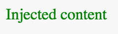

# Module 4: Web components and other HTML5 APIs section


## 4.5 Final exam (26 Questions)


### 4.5.1 Web components (1-5)

1. Were you aware?

  While reading the course' Module 1 content, were we using Web components without realising it? (Yes/No)

  Ans: Yes<br>
  Explanation: Yes, as we discussed during Module 4, the `<video>` and `<audio>` elements are Web components created by the browsers' developers.


2. Valid or invalid?

  ```html
  <x-gif src="http://i.imgur.com/iKXH4E2.gif" ping-pong></x-gif>
  ```

  Is this code valid HTML5 code, if the `<x-gif>` element has been created using the Custom Elements API? (yes/No)

  Ans: Yes<br>
  Explanation: Yes, any custom element created with the Custom Elements API is valid HTML.


3. Import me!

  ```html
  <script type="module" src="mycomponent.js"></script>
  ```

  What does the above line do?

  a. We cannot use this syntax to import WebComponents. The correct way is to use HTML imports.<br>
  b. This is how a JavaScript module can be loaded in a HTML page. This is the modern way to import WebComponents.<br>

  Ans: b<br>
  Explanation: HTML imports are obsolete now. The preferred way to import WebComponents is to load them as JavaScript/EcmaScript modules.


4. Am I well supported?

  Is it possible to properly render a page that uses Web components on modern browsers?

  a. Most browsers support WebComponents, and good polyfills are available to run on old browsers.<br>
  b. Unfortunately, Web components use APIs that are not well supported by many of the major browsers, even the most recent versions<br>

  Ans: a<br>
  Explanation: Most browsers now support the three main WebComponents API (HTML template, Shadow DOM, Custom Elements) and importing Web Components relies on JavaScript Imports that are also well supported. To maximize support, polyfills are also available.


5. Am I made of Web components?

  Which of the following frameworks are based on Web components? (2 correct answers.)

  a. jQuery<br>
  b. AngularJS<br>
  c. Lit-HTML<br>
  d. X-Tags<br>
  e. Bower<br>

  Ans: <font style="color: red;">cd</font>, xad<<br>
  Explanation: Lit-HTML (by Google) and X-Tags (by Mozilla) are frameworks built on Web components.


### 4.5.2 HTML5 templates (6-8)

6. Dead or alive?

  The code in HTML templates is:

  a. to be rendered, the content of a template needs to be cloned within JavaScript, and the cloned version inserted into the DOM of a document.<br>
  b. the same as any other unit of HTML code. When a page includes a template, it's rendered amongst the rest of the HTML code.<br>
  
  Ans: a<br>
  Explanation: Template code is inert: it cannot be rendered! If you practice object-oriented programming: it's similar to a "sort of class" that needs to be instantiated before use. The instantiation process consists of cloning the template's content and adding that to the DOM of a document.


<hr>

__Source code for the next 2 questions (7 and 8)__

HTML:

<div class="source-code"><ol class="linenums">
<li class="L0" style="margin-bottom: 0px;" value="1"><span class="pln"> </span><span class="tag">&lt;template</span><span class="pln"> </span><span class="atn">id</span><span class="pun">=</span><span class="atv">"mytemplate"</span><span class="tag">&gt;</span></li>
<li class="L1" style="margin-bottom: 0px;"><span class="pln">&nbsp; &nbsp;</span><span class="tag">&lt;img</span><span class="pln"> </span><span class="atn">src</span><span class="pun">=</span><span class="atv">""</span><span class="pln">&nbsp;id="myImage"&nbsp;</span><span class="atn">alt</span><span class="pun">=</span><span class="atv">"a great image"</span><span class="tag">&gt;</span></li>
<li class="L2" style="margin-bottom: 0px;"><span class="pln">&nbsp; &nbsp;</span><span class="tag">&lt;div</span><span class="pln"> </span><span class="atn">class</span><span class="pun">=</span><span class="atv">"comment"</span><span class="tag">&gt;</span><span class="pln">hello</span><span class="tag">&lt;/div&gt;</span></li>
<li class="L3" style="margin-bottom: 0px;"><span class="pln"> </span><span class="tag">&lt;/template&gt;</span><span class="pln"> </span></li>
</ol></div>

JavaScript:

<div class="source-code"><ol class="linenums">
<li class="L0" style="margin-bottom: 0px;" value="1"><span class="kwd">function</span><span class="pln"> instanciate</span><span class="pun">()</span><span class="pln"> </span><span class="pun">{</span></li>
<li class="L1" style="margin-bottom: 0px;"><span class="kwd">&nbsp; &nbsp;var</span><span class="pln"> t </span><span class="pun">=</span><span class="pln"> document</span><span class="pun">.</span><span class="pln">querySelector</span><span class="pun">(</span><span class="str">'#mytemplate'</span><span class="pun">);</span></li>
<li class="L2" style="margin-bottom: 0px;"><span class="pln"> </span></li>
<li class="L3" style="margin-bottom: 0px;"><span class="pln">&nbsp; &nbsp;<span style="color: #ff0000;"><strong>XXX</strong></span></span><span class="pun">.</span><span class="pln">querySelector</span><span class="pun">(</span><span class="str">'#myImage'</span><span class="pun">).</span><span class="pln">src </span><span class="pun">=</span></li>
<li class="L4" style="margin-bottom: 0px;"><span class="str">&nbsp; &nbsp; &nbsp; &nbsp; &nbsp; &nbsp; &nbsp; 'http://webcomponents.github.io/img/logo.svg'</span><span class="pun">;</span></li>
<li class="L5" style="margin-bottom: 0px;"><span class="pln">&nbsp;</span></li>
<li class="L6" style="margin-bottom: 0px;"><span class="kwd">&nbsp; &nbsp;var</span><span class="pln"> clone </span><span class="pun">=</span><span class="pln"> document</span><span class="pun">.<span style="color: #0000ff;"><strong>YYY</strong></span></span><span class="pun">(<span style="color: #ff0000;"><strong>XXX</strong></span></span><span class="pun">,</span><span class="pln"> </span><span class="kwd">true</span><span class="pun">);</span></li>
<li class="L8" style="margin-bottom: 0px;"><span class="pln"> </span></li>
<li class="L9" style="margin-bottom: 0px;"><span class="pln">&nbsp; &nbsp;</span><span class="com">// add it to the body of the HTML document</span></li>
<li class="L0" style="margin-bottom: 0px;"><span class="pln">&nbsp; &nbsp;document</span><span class="pun">.</span><span class="pln">body</span><span class="pun">.</span><span class="pln">appendChild</span><span class="pun">(</span><span class="pln">clone</span><span class="pun">);</span><span class="pln"> </span></li>
<li class="L1" style="margin-bottom: 0px;"><span class="pun">}</span></li>
</ol></div>

7. Give me content!

  How would you complete the source code above to access the content of the template? Enter exactly what you would put instead of the __XXX__ placeholders!
  
  Ans: `t.content`<br>
  Explanation: In the above example, the right answer is `t.content`


8. Clone me!

  How would you clone the content of the template? Enter exactly what you would enter instead of the __YYY__ placeholder!
  
  Ans: `importNode`<br>
  Explanation: In the above example, the right answer is `importNode`


### 4.5.3Shadow DOM (9-13)

9. Really hidden?

  Only a few current browsers, e.g. Google or Chrome, offer native support for the shadow DOM API. Is it possible to use the devtools to inspect the HTML source of a Web component even if it's located in the shadow DOM? (Yes/No)

  Ans: Yes<br>
  Explanation: By default, the shadow DOM content is hidden, but on Chrome and Opera (which support the shadow DOM natively), it's possible to use a setting in the devtools to expose the shadow DOM for debugging purposes. This was shown in several videos during the course.


<hr>

__Source code for the next three questions (10, 11, and 12)__

<div class="source-code"><ol class="linenums">
<li class="L0" style="margin-bottom: 0px;" value="1"><span class="tag">&lt;p&gt;Please&nbsp;show me!</span><span class="tag">&lt;/p&gt;</span></li>
<li class="L1" style="margin-bottom: 0px;"><span class="tag">&lt;script&gt;</span></li>
<li class="L2" style="margin-bottom: 0px;"><span class="pln">&nbsp; &nbsp;&nbsp;</span><span class="kwd">var</span><span class="pln">&nbsp;b&nbsp;</span><span class="pun">=</span><span class="pln"> document</span><span class="pun">.</span><span class="pln">querySelector</span><span class="pun">(</span><span class="str">'p'</span><span class="pun">);</span></li>
<li class="L3" style="margin-bottom: 0px;"><span class="pln">&nbsp; &nbsp;&nbsp;</span><span class="kwd">var</span><span class="pln">&nbsp;c&nbsp;</span><span class="pun">=</span><span class="pln"> b</span><span class="pun">.</span><span class="pun"><span color="#000000" style="color: #000000;">attachShadow({mode: 'open'});</span>;</span></li>
<li class="L4" style="margin-bottom: 0px;"><span class="pln">&nbsp; &nbsp;&nbsp;c</span><span class="pun">.</span><span class="pln">textContent </span><span class="pun">=</span><span class="pln"> </span><span class="str">'I am a nice paragraph!'</span><span class="pun">;</span></li>
<li class="L5" style="margin-bottom: 0px;"><span class="tag">&lt;/script&gt;</span></li>
</ol></div>

10. Who am I?

  The paragraph b is called a "shadow __XXXX__". What is the correct term (instead of __XXXX__)?

  Ans: <font style="color: red">host<font>, xroot<br>
  Explanation: The paragraph b is called a _shadow host_


11. What is my name?

  The variable c is called a "shadow __YYYY__". What is the correct term (instead of __YYYY__)?

  Ans: host<br>
  Explanation: The variable c is called a _shadow root_


12. Please show me!

  What is going to be rendered on the page?

  a. "I am a nice paragraph!"<br>
  a. "Please show me!"<br>

  Ans: a<br>
  Explanation: When an element has a shadow root, the content of the shadow DOM is rendered: in this case, it is "I am a nice paragraph!"


13. The shadow of robots?

What relationship exists between Isaac Asimov and the Shadow DOM?

  a. Isaac Asimov wrote "The Three Laws of Robotics", and the shadow DOM is also governed by three rules.<br>
  a. Isaac Asimov was born in a small Russian house called DOMA.<br>
  a. No relationship.<br>

  Ans: <font style="color: red">a</font>, xc<br>
  Explanation: Three rules do govern the shadow DOM: 1) With Shadow DOM, elements are associated with a new kind of node: a shadow root; 2) An element that has a shadow root associated with it is called a shadow host; 3) The content of a shadow host isn’t rendered; the content of the shadow root is rendered in its place.


### 4.5.4 Shadow DOM encapsulation (14-17)

14. The red and the black

  A page uses a Web component: a nice custom calendar. In this Web component's shadow DOM there are some buttons for rendering the calendar dates. Within the shadow DOM, CSS styles buttons to have a black background.

  On the page that uses the calendar Web component, we also have some buttons and a CSS style directing a red background for buttons.

  Which color will be applied to which buttons?

  a. The buttons on the page will be black, and the ones in the calendar will be red<br>
  b. The buttons on the page and those in the calendar will all be black<br>
  c. The buttons on the page will be red, and the ones in the calendar will be black<br>
  d. The buttons on the page and those in the calendar will all be red<br>
  
  Ans: c<br>
  Explanation: By default, CSS styles do not cross the boundaries of the Web component. The CSS from the shadow DOM of the Web component will not affect the buttons in the page, and the same is true for the CSS styles defined globally: they will affect buttons defined in the page but not those in Web Components. The buttons on the page will be red, and the ones in the calendar will be black.


15. Incompatible designs

  Is it possible to clone a template into a Web component's shadow DOM? (Yes/No)

  Ans: Yes<br>
  Explanation: Yes, and this is a very powerful feature! The template will be the HTML/CSS/JS skeleton of the Web component.


<hr>

__Source code for the next two questions (16 and 17)__

HTML:

<div class="source-code"><ol class="linenums">
<li class="L0" style="margin-bottom: 0px;" value="1"><span class="tag">&lt;head&gt;</span></li>
<li class="L1" style="margin-bottom: 0px;"><span class="tag">&nbsp; &lt;style&gt;</span></li>
<li class="L2" style="margin-bottom: 0px;"><span class="pln">&nbsp; &nbsp; span </span><span class="pun">{</span></li>
<li class="L3" style="margin-bottom: 0px;"><span class="pln">&nbsp; &nbsp; &nbsp; color</span><span class="pun">:</span><span class="pln">green</span><span class="pun">;</span></li>
<li class="L4" style="margin-bottom: 0px;"><span class="pln"></span><span class="pun">&nbsp; &nbsp; }</span></li>
<li class="L5" style="margin-bottom: 0px;"><span class="tag">&nbsp; &lt;/style&gt;</span></li>
<li class="L6" style="margin-bottom: 0px;"><span class="tag">&lt;/head&gt;</span></li>
<li class="L7" style="margin-bottom: 0px;"><span class="tag">&lt;template</span><span class="pln"> </span><span class="atn">id</span><span class="pun">=</span><span class="atv">"mytemplate"</span><span class="tag">&gt;</span></li>
<li class="L8" style="margin-bottom: 0px;"><span class="pln"></span><span class="tag">&nbsp; &lt;style&gt;</span></li>
<li class="L9" style="margin-bottom: 0px;"><span class="pln">&nbsp; &nbsp; h1 </span><span class="pun">{</span></li>
<li class="L0" style="margin-bottom: 0px;"><span class="pln">&nbsp; &nbsp; &nbsp; color</span><span class="pun">:</span><span class="pln">red</span><span class="pun">;</span></li>
<li class="L1" style="margin-bottom: 0px;"><span class="pln"></span><span class="pun">&nbsp; &nbsp; }</span></li>
<li class="L2" style="margin-bottom: 0px;"><span class="pln">&nbsp; &nbsp; span </span><span class="pun">{</span></li>
<li class="L3" style="margin-bottom: 0px;"><span class="pln">&nbsp; &nbsp; &nbsp; background</span><span class="pun">-</span><span class="pln">color</span><span class="pun">:</span><span class="pln">lightblue</span><span class="pun">;</span><span class="pln"> </span></li>
<li class="L4" style="margin-bottom: 0px;"><span class="pln"></span><span class="pun">&nbsp; &nbsp; }</span></li>
<li class="L5" style="margin-bottom: 0px;"><span class="pln"></span><span class="tag">&nbsp; &lt;/style&gt;</span></li>
<li class="L6" style="margin-bottom: 0px;"><span class="pln"></span><span class="tag">&nbsp; &lt;h1&gt;</span><span class="pln">Magnificient title</span><span class="tag">&lt;/h1&gt;</span></li>
<li class="L7" style="margin-bottom: 0px;"><span class="pln"></span><span class="tag">&nbsp; &lt;span&gt;</span><span class="pln">And I'm a span in the shadow DOM</span><span class="tag">&lt;/span&gt;</span></li>
<li class="L8" style="margin-bottom: 0px;"><span class="pln"></span><span class="tag">&nbsp; &lt;p&gt;</span></li>
<li class="L9" style="margin-bottom: 0px;"><span class="pln"></span><span class="tag">&nbsp; &lt;slot</span><span class="pln"> </span><span class="atn">name</span><span class="pun">=</span><span class="atv">"my-text"</span><span class="tag">&gt;</span><span class="pln">My default text</span><span class="tag">&lt;/slot&gt;</span></li>
<li class="L0" style="margin-bottom: 0px;"><span class="tag">&lt;/template&gt;</span></li>
<li class="L1" style="margin-bottom: 0px;"><span class="pln"> </span></li>
<li class="L2" style="margin-bottom: 0px;"><span class="tag">&lt;body&gt;</span></li>
<li class="L3" style="margin-bottom: 0px;"><span class="tag">&nbsp; &lt;h1&gt;</span><span class="pln">Hello my friends</span><span class="tag">&lt;/h1&gt;</span></li>
<li class="L4" style="margin-bottom: 0px;"><span class="pln"></span><span class="tag">&nbsp; &lt;p</span><span class="pln"> </span><span class="atn">id</span><span class="pun">=</span><span class="atv">"myWidget"</span><span class="tag">&gt;</span></li>
<li class="L5" style="margin-bottom: 0px;"><span class="pln"></span><span class="tag">&nbsp; &nbsp; &lt;span</span><span class="pln"> </span><span class="atn">slot</span><span class="pun">=</span><span class="atv">"my-text"</span><span class="tag">&gt;</span><span class="pln">Injected content</span><span class="tag">&lt;/span&gt;</span></li>
<li class="L6" style="margin-bottom: 0px;"><span class="pln"></span><span class="tag">&nbsp; &lt;/p&gt;</span></li>
<li class="L7" style="margin-bottom: 0px;"><span class="pln"> </span></li>
<li class="L8" style="margin-bottom: 0px;"><span class="pln"></span><span class="tag">&nbsp; &lt;p&gt;</span><span class="pln">This is not in the previous paragraph...</span><span class="tag">&lt;/p&gt;</span></li>
<li class="L9" style="margin-bottom: 0px;"><span class="tag">&lt;/body&gt;</span></li>
</ol></div>

JavaScript:

<div class="source-code"><ol class="linenums">
<li class="L0" style="margin-bottom: 0px;" value="1"><span class="com">// Instanciate the template</span></li>
<li class="L1" style="margin-bottom: 0px;"><span class="kwd">var</span><span class="pln"> t </span><span class="pun">=</span><span class="pln"> document</span><span class="pun">.</span><span class="pln">querySelector</span><span class="pun">(</span><span class="str">'#mytemplate'</span><span class="pun">);</span></li>
<li class="L2" style="margin-bottom: 0px;"><span class="pln">&nbsp;</span></li>
<li class="L3" style="margin-bottom: 0px;"><span class="com">// Create a root node under our h1 title</span></li>
<li class="L4" style="margin-bottom: 0px;"><span class="kwd">var</span><span class="pln"> host </span><span class="pun">=</span><span class="pln"> document</span><span class="pun">.</span><span class="pln">querySelector</span><span class="pun">(</span><span class="str">'#myWidget'</span><span class="pun">);</span></li>
<li class="L5" style="margin-bottom: 0px;"><span class="kwd">const</span><span class="pln"> shadowRoot </span><span class="pun">=</span><span class="pln"> host</span><span class="pun">.</span><span class="pln">attachShadow</span><span class="pun">({</span><span class="pln">mode</span><span class="pun">:</span><span class="pln"> </span><span class="str">'open'</span><span class="pun">});</span></li>
<li class="L6" style="margin-bottom: 0px;"><span class="pln">&nbsp;</span></li>
<li class="L7" style="margin-bottom: 0px;"><span class="pln">&nbsp;</span></li>
<li class="L8" style="margin-bottom: 0px;"><span class="pln">shadowRoot</span><span class="pun">.</span><span class="pln">appendChild</span><span class="pun">(</span><span class="pln">document</span><span class="pun">.</span><span class="pln">importNode</span><span class="pun">(</span><span class="pln">t</span><span class="pun">.</span><span class="pln">content</span><span class="pun">,</span><span class="pln"> </span><span class="kwd">true</span><span class="pun">));</span></li>
</ol></div>

16. Choose the nicest one!

  How will `<p id="myWidget">...</p>` be rendered? (Beware: 3 points are awarded for this problem.)

  <div style="margin: 0.5em; display: flex; justify-content: center; align-items: center; flex-flow: row wrap;">
    <a href="https://bit.ly/3xtUqJR" ismap target="_blank">
      a. 
      b. 
      c. 
    </a>
    <a href="https://bit.ly/3xtUqJR" ismap target="_blank">
      d. 
      e. 
    </a>
  </div>

  Ans: b<br>
  Explanation:
    + The JavaScript code associates a shadow root (a shadow DOM) with the host (the `<p id="myWidget">` element). So the text "Injected content" alone is not the correct answer as the content of the shadow DOM (a cloned template) will be rendered.
    + Let's look at the CSS styles. The H1 will be red, for sure. The injected span belongs to the main page, it's just "moved inside the shadow DOM" but will not belong to it. So the global style on spans will apply and it will be green. The other span is defined in the template but there is an internal CSS rule that applies to templates: only CSS rules defined in the template will target elements inside the shadow DOM. In this case this rule will apply to all spans in the shadow DOM of the host and the span will have a light blue background color.
    + Check with [this JsBin](https://jsbin.com/sirepaq/edit).
    + [Local Demo](src/04e-example01.html)


__Additional code for the next question (17)__

<div class="source-code"><ol class="linenums">
<li class="L0" style="margin-bottom: 0px;" value="1"><span class="tag">&lt;template</span><span class="pln"> </span><span class="atn">id</span><span class="pun">=</span><span class="atv">"mytemplate"</span><span class="tag">&gt;</span></li>
<li class="L1" style="margin-bottom: 0px;"><span class="pln"></span><span class="tag">&nbsp; &lt;style&gt;</span></li>
<li class="L2" style="margin-bottom: 0px;"><span class="pln"></span><span class="pun">&nbsp; &nbsp; <strong>:</strong></span><strong><span class="pln">host</span><span class="pun">(:</span><span class="pln">hover</span><span class="pun">){</span></strong></li>
<li class="L3" style="margin-bottom: 0px;"><strong><span class="pln">&nbsp; &nbsp; &nbsp; background</span><span class="pun">-</span><span class="pln">color</span><span class="pun">:</span><span class="pln">pink</span><span class="pun">;</span></strong></li>
<li class="L4" style="margin-bottom: 0px;"><strong><span class="pln"></span><span class="pun">&nbsp; &nbsp; }</span></strong></li>
<li class="L5" style="margin-bottom: 0px;"><span class="pln">&nbsp; &nbsp; h1 </span><span class="pun">{</span></li>
<li class="L6" style="margin-bottom: 0px;"><span class="pln">&nbsp; &nbsp; &nbsp; color</span><span class="pun">:</span><span class="pln">red</span><span class="pun">;</span></li>
<li class="L7" style="margin-bottom: 0px;"><span class="pln"></span><span class="pun">&nbsp; &nbsp; }</span></li>
<li class="L8" style="margin-bottom: 0px;"><span class="pln">&nbsp; &nbsp; span </span><span class="pun">{</span></li>
<li class="L9" style="margin-bottom: 0px;"><span class="pln">&nbsp; &nbsp; &nbsp; background</span><span class="pun">-</span><span class="pln">color</span><span class="pun">:</span><span class="pln">lightblue</span><span class="pun">;</span><span class="pln"> </span></li>
<li class="L0" style="margin-bottom: 0px;"><span class="pln"></span><span class="pun">&nbsp; &nbsp; }</span></li>
<li class="L1" style="margin-bottom: 0px;"><span class="pln"> </span><span class="tag">&lt;/style&gt;</span></li>
<li class="L2" style="margin-bottom: 0px;"><span class="pln">...</span></li>
<li class="L3" style="margin-bottom: 0px;"><span class="pln">&lt;/template&gt;</span></li>
</ol></div>

17. Pink fairies ...

  From the addional code above, a CSS rule in the template code changes the background color to pink whenever the mouse cursor hovers over selected elements...

  What will this do when we roll the mouse over `<p id='myWidget'>`?

  a. It will only change the background color of the content in the shadow DOM of the `<p id="myWidget">` element.<br>
  b. It will only change the background color of the content rendered corresponding to `<p id="myWidget">` (shadow DOM + injected content).<br>
  c. It will change the background color of all the text rendered in the page.<br>

  Ans:b<br>
  Explanation: 
    + All the text rendered for `<p id='myWidget'>` (the shadow host) will react to the mouse hover event and you will see its background color changed to pink. Try out [this JsBin](https://jsbin.com/kiluris/edit?html). The rest of the page (the H1 and the P after `<p id='myWidget'>`) remains unchanged.
    + [Local Demo](src/04e-example02.html)


### 4.5.5 Custom elements and importing WebComponents (18-20)

18. Give me a name!

  Do custom elements extend other HTML elements (or more precisely, extend the generic element type called HTMLElement)? (Yes/No)

  Ans: Yes<br>
  Explanation: In JavaScript, to create element A that extends element B, element A must inherit the prototype of element B. By default, custom elements inherit from `HTMLElement`. But you can also inherit from pre-existing elements, for example from `HTMLButton`.


19. Custom elements

  In this code : `customElements.define('my-widget', MyWidget);`, what is the second parameter?

  a. The host element<br>
  b. A JavaScript class<br>
  c. A template<br>

  Ans: b<br>
  Explanation: The second parameter is a JavaScript class object that defines the behavior of the element.


20. Are HTML imports obsolete?

  How do you import Web Components into a Web page or a Web application?

  a. Using JavaScript module import (typically `<script type="module" src="./mycomponent/index.js"></script>`)<br>
  b. Using HTML imports (typically `<link rel="import" href="myComponent/index.html">`)<br>

  Ans: <font style="color: red;">a</font>, xb<br>
  Explanation: HTML imports was intended to be the packaging mechanism for Web components. Now, the preferred way is to use JavaScript modules.


### 4.5.6 Orientation and Motion APIs (21-26)

__Source code for the next 4 questions (21, 22, 23 and 24)__

<div class="source-code"><ol class="linenums">
<li class="L0" style="margin-bottom: 0px;" value="1"><span class="pun">...</span></li>
<li class="L1" style="margin-bottom: 0px;"><span class="pln"> </span><span class="str">&lt;h2&gt;</span><span class="typ">Device</span><span class="pln"> </span><span class="typ">Orientation</span><span class="pln"> </span><span class="kwd">with</span><span class="pln"> HTML5</span><span class="pun">&lt;/</span><span class="pln">h2</span><span class="pun">&gt;</span></li>
<li class="L2" style="margin-bottom: 0px;"><span class="typ">You</span><span class="pln"> need to be on a mobile device </span><span class="kwd">or</span><span class="pln"> </span><span class="kwd">use</span><span class="pln"> a laptop </span><span class="kwd">with</span><span class="pln"> </span></li>
<li class="L2" style="margin-bottom: 0px;"><span class="pln">accelerometer</span><span class="pun">/</span><span class="pln">orientation&nbsp;</span><span class="pln">device</span><span class="pun">.</span></li>
<li class="L4" style="margin-bottom: 0px;"><span class="pln"> </span><span class="str">&lt;p&gt;</span></li>
<li class="L5" style="margin-bottom: 0px;"><span class="pln"> </span><span class="pun">&lt;</span><span class="pln">div id</span><span class="pun">=</span><span class="str">"LR"</span><span class="pun">&gt;&lt;/</span><span class="pln">div</span><span class="pun">&gt;</span></li>
<li class="L6" style="margin-bottom: 0px;"><span class="pln"> </span><span class="pun">&lt;</span><span class="pln">div id</span><span class="pun">=</span><span class="str">"FB"</span><span class="pun">&gt;&lt;/</span><span class="pln">div</span><span class="pun">&gt;</span></li>
<li class="L7" style="margin-bottom: 0px;"><span class="pln"> </span><span class="pun">&lt;</span><span class="pln">div id</span><span class="pun">=</span><span class="str">"DIR"</span><span class="pun">&gt;&lt;/</span><span class="pln">div</span><span class="pun">&gt;</span></li>
<li class="L8" style="margin-bottom: 0px;"><span class="pln"> </span><span class="pun">&lt;</span><span class="pln">script type</span><span class="pun">=</span><span class="str">"text/javascript"</span><span class="pun">&gt;</span></li>
<li class="L9" style="margin-bottom: 0px;"><span class="pln">&nbsp; &nbsp; &nbsp;</span><span class="kwd">if</span><span class="pln"> </span><span class="pun">(</span><span class="pln">window</span><span class="pun">.</span><span class="typ">DeviceOrientationEvent</span><span class="pun">)</span><span class="pln"> </span><span class="pun">{</span></li>
<li class="L0" style="margin-bottom: 0px;"><span class="pln">&nbsp; &nbsp; &nbsp; &nbsp; &nbsp;console</span><span class="pun">.</span><span class="pln">log</span><span class="pun">(</span><span class="str">"DeviceOrientation is supported"</span><span class="pun">);</span></li>
<li class="L1" style="margin-bottom: 0px;"><span class="pln">&nbsp; &nbsp; &nbsp; &nbsp; &nbsp;window</span><span class="pun">.</span><span class="pln">addEventListener</span><span class="pun">(<span style="color: #ff0000;"><strong><span color="#008800" style="color: #008800;">XXX</span></strong></span></span><span class="pun">,</span><span class="pln"> </span><span class="kwd">function</span><span class="pun">(</span><span class="pln">eventData</span><span class="pun">)</span><span class="pln"> </span><span class="pun">{</span></li>
<li class="L4" style="margin-bottom: 0px;"><span class="com">&nbsp; &nbsp; &nbsp; &nbsp; &nbsp; &nbsp;// front/back inclination</span></li>
<li class="L5" style="margin-bottom: 0px;"><span class="pln">&nbsp; &nbsp; &nbsp; &nbsp; &nbsp; &nbsp;</span><span class="kwd">var</span><span class="pln"> FB </span><span class="pun">=</span><span class="pln"> eventData</span><span class="pun">.<strong>ZZZ</strong></span><span class="pun">;</span></li>
<li class="L6" style="margin-bottom: 0px;"><span class="pln">&nbsp; &nbsp; &nbsp; &nbsp; &nbsp; &nbsp;</span><span class="com">// orientation</span></li>
<li class="L7" style="margin-bottom: 0px;"><span class="pln">&nbsp; &nbsp; &nbsp; &nbsp; &nbsp; &nbsp;</span><span class="kwd">var</span><span class="pln"> DIR </span><span class="pun">=</span><span class="pln"> eventData</span><span class="pun">.<strong>TTT</strong></span><span class="pun">;</span></li>
<li class="L2" style="margin-bottom: 0px;"><span class="pln">&nbsp; &nbsp; &nbsp; &nbsp; &nbsp; &nbsp;</span><span class="com">// left/right inclination</span></li>
<li class="L3" style="margin-bottom: 0px;"><span class="pln">&nbsp; &nbsp; &nbsp; &nbsp; &nbsp; &nbsp;</span><span class="kwd">var</span><span class="pln"> LR </span><span class="pun">=</span><span class="pln"> eventData</span><span class="pun">.<strong>YYY</strong></span><span class="pun">;</span></li>
<li class="L4" style="margin-bottom: 0px;"><span class="pln">&nbsp; &nbsp; &nbsp; &nbsp; &nbsp; &nbsp;</span><span class="com">// display values on screen</span></li>
<li class="L9" style="margin-bottom: 0px;"><span class="pln">&nbsp; &nbsp; &nbsp; &nbsp; &nbsp; &nbsp;deviceOrientationHandler</span><span class="pun">(</span><span class="pln"><span class="pln">FB</span><span class="pun">,</span><span class="pln"> DIR,&nbsp;</span>LR</span><span class="pun">);</span></li>
<li class="L0" style="margin-bottom: 0px;"><span class="pln">&nbsp; &nbsp; &nbsp; &nbsp;</span><span class="pun">},</span><span class="pln"> </span><span class="kwd">false</span><span class="pun">);</span></li>
<li class="L1" style="margin-bottom: 0px;"><span class="pln">&nbsp; </span><span class="pun">}</span><span class="pln"> </span><span class="kwd">else</span><span class="pln"> </span><span class="pun">{</span></li>
<li class="L2" style="margin-bottom: 0px;"><span class="pln">&nbsp; &nbsp; &nbsp; alert</span><span class="pun">(</span><span class="str">"Device orientation not supported on your device or browser. Sorry."</span><span class="pun">);</span></li>
<li class="L3" style="margin-bottom: 0px;"><span class="pln">&nbsp;&nbsp;</span><span class="pun">}</span></li>
<li class="L4" style="margin-bottom: 0px;"><span class="pln">&nbsp;&nbsp;</span><span class="kwd">function</span><span class="pln"> deviceOrientationHandler</span><span class="pun">(</span><span class="pln"><span class="pln">FB</span><span class="pun">,</span><span class="pln"> DIR,&nbsp;</span>LR</span><span class="pun">)</span><span class="pln"> </span><span class="pun">{</span></li>
<li class="L5" style="margin-bottom: 0px;"><span class="pln">&nbsp; &nbsp; document</span><span class="pun">.</span><span class="pln">querySelector</span><span class="pun">(</span><span class="str">"#LR"</span><span class="pun">).</span><span class="pln">innerHTML &nbsp;<span style="color: #666600;" color="#666600">=&nbsp;</span></span><span class="str">""</span><span class="pln"> </span><span class="pun">+</span><span class="pln"> </span><span class="typ">Math</span><span class="pun">.</span><span class="pln">round</span><span class="pun">(</span><span class="pln">LR</span><span class="pun">);</span></li>
<li class="L6" style="margin-bottom: 0px;"><span class="pln">&nbsp; &nbsp; document</span><span class="pun">.</span><span class="pln">querySelector</span><span class="pun">(</span><span class="str">"#FB"</span><span class="pun">).</span><span class="pln">innerHTML &nbsp;</span><span class="pun">=</span><span class="pln"> </span><span class="str">""</span><span class="pln"> </span><span class="pun">+</span><span class="pln"> </span><span class="typ">Math</span><span class="pun">.</span><span class="pln">round</span><span class="pun">(</span><span class="pln">FB</span><span class="pun">);</span></li>
<li class="L7" style="margin-bottom: 0px;"><span class="pln">&nbsp; &nbsp; document</span><span class="pun">.</span><span class="pln">querySelector</span><span class="pun">(</span><span class="str">"#DIR"</span><span class="pun">).</span><span class="pln">innerHTML </span><span class="pun">=</span><span class="pln"> </span><span class="str">""</span><span class="pln"> </span><span class="pun">+</span><span class="pln"> </span><span class="typ">Math</span><span class="pun">.</span><span class="pln">round</span><span class="pun">(</span><span class="pln">DIR</span><span class="pun">);</span></li>
<li class="L8" style="margin-bottom: 0px;"><span class="pln">&nbsp;&nbsp;</span><span class="pun">}</span></li>
<li class="L9" style="margin-bottom: 0px;"><span class="pln"> </span><span class="pun">&lt;/</span><span class="pln">script</span><span class="pun">&gt;</span></li>
</ol></div>

21. What is it called... I can't remember...

  We would like to display a smartphone's angles of orientation.

  What is the name of the event we must to listen for? What would you enter instead of the XXX placeholder in the above code?

  Ans: <br>
  Explanation: 


22. Sometimes I feel like a....

  We would like to display a smartphone's angles of orientation.

  What is the name of the property for the front/back angle? What would you put instead of the ZZZ placeholder in the above code?

  Ans: <br>
  Explanation: 


23. Left or right?

  We would like to display a smartphone's angles of orientation.

  What is the name of the property for the left/right angle? What would you put instead of the YYY placeholder in the above code?

  Ans: <br>
  Explanation: 


24. Give me the orientation!

  We would like to display a smartphone's angles of orientation.

  What is the name of the property for the horizontal orientation angle? What would you put instead of the TTT placeholder in the above code?

  Ans: <br>
  Explanation: 


25. Degrees or radians?

  Returned angles are in?

  a. Degrees<br>
  b. Radians<br>

  Ans: <br>
  Explanation: 


26. Motion or orientation, make a choice!

What is the difference between the Device Motion API and the Orientation API?

  a. The Orientation API is the only one that can tell if the device is oriented to the sky.<br>
  b. The DeviceMotion API deals with accelerations as well as orientations.<br>
  c. One works only when the device is stable, the other one when it's in motion.<br>

  Ans: <br>
  Explanation: 

